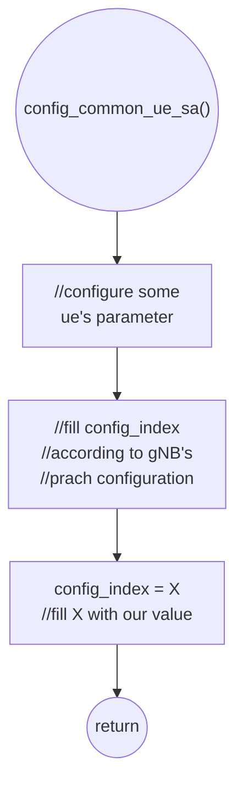
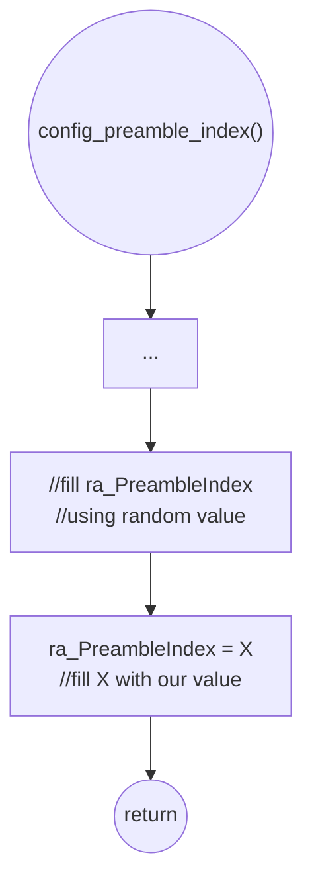

# Docs Folder Structure

**Folder Structure:**
```
docs
├── installation-guide.md             : How to install attacker and gNB
├── integration-guide.md              : How to integrate and test gNB, attacker, and UE
├── user-manual.md                    : How to use attacker and gNB and modify their parameters
├── simulation-guide.ipynb            : Jupyter notebook to generate figures from experiment dataset
├── wilfrid-research-and-projects.md  : Wilfrid handover checklist
├── old-docs                          : Old notes for thesis development
├── reviews/wilfrid.md                : Oral exam QA for Wilfrid
```

# User Manual for RACH Attacker and Other Related Components

**References:**
- [OAI 5G NR SA tutorial with OAI nrUE](https://gitlab.eurecom.fr/oai/openairinterface5g/-/blob/develop/doc/NR_SA_Tutorial_OAI_nrUE.md?ref_type=heads)
- [Attacker guide for Wilfrid paper](https://ntust-bmwlab.notion.site/Attacker-guide-for-Wilfrid-paper-12d1009831438064b6afcf322b4fa252)
- [MTK UE Guide](https://github.com/bmw-ece-ntust/o-ran-docs/blob/2022-MS-Summer-OAI/UE/MTK%20UE/MTK%20UE%20Guide.md)

**Table of Contents:**
- [User Manual for RACH Attacker and Other Related Components](#user-manual-for-rach-attacker-and-other-related-components)
  * [0. Prerequisite](#0-prerequisite)
  * [1. HW and SW Specifications](#1-hw-and-sw-specifications)
    + [1.0. IMPORTANT NOTE ABOUT OAI VERSION](#10-important-note-about-oai-version)
    + [1.1. OAI gNB with USRP](#11-oai-gnb-with-usrp)
      - [1.1.1. Hardware](#111-hardware)
      - [1.1.2. Software](#112-software)
    + [1.2. OAI UE with USRP for attacker](#12-oai-ue-with-usrp-for-attacker)
      - [1.2.1. Hardware](#121-hardware)
      - [1.2.2. Hardware](#122-hardware)
  * [2. Run Msg1 Attacker](#2-run-msg1-attacker)
    + [2.1. Changing Msg1 Attacker parameters](#21-changing-msg1-attacker-parameters)
      - [2.1.1. Controlling Msg1 Attacker Transmit Power](#211-controlling-msg1-attacker-transmit-power)
      - [2.1.2. Controlling Msg1 Attacker `prach-ConfigurationIndex`](#212-controlling-msg1-attacker-prach-configurationindex)
      - [2.1.3. Controlling Msg1 Attacker preamble ID](#213-controlling-msg1-attacker-preamble-id)
  * [3. Run Msg3 Attacker](#3-run-msg3-attacker)
  * [4. Run UE](#4-run-ue)
    + [4.1. Changing UE parameters](#41-changing-ue-parameters)
      - [4.1.1. Controlling UE Msg1 & Msg3 Transmit Power](#411-controlling-ue-msg1--msg3-transmit-power)
  * [5. Run Regular gNB](#5-run-regular-gnb)
    + [5.1. Changing regular gNB parameters](#51-changing-regular-gnb-parameters)
      - [5.1.1. Controlling gNB's Transmit Power](#511-controlling-gnbs-transmit-power)
      - [5.1.2. Controlling gNB's noise threshold update factor](#512-controlling-gnbs-noise-threshold-update-factor)
      - [5.1.3. Controlling gNB's Msg1 power detection threshold](#513-controlling-gnbs-msg1-power-detection-threshold)
  * [6. Run Energy Saving gNB](#6-run-energy-saving-gnb)
    + [6.1. Changing Energy Saving gNB parameters](#61-changing-energy-saving-gnb-parameters)
      - [6.1.1. Controlling gNB's Active Duration](#611-controlling-gnbs-active-duration)
      - [6.1.2. Controlling gNB's WUS preamble index](#612-controlling-gnbs-wus-preamble-index)

<small><i><a href='http://ecotrust-canada.github.io/markdown-toc/'>Table of contents generated with markdown-toc</a></i></small>

## 0. Prerequisite

- <b>Please read [installation-guide.md](https://github.com/bmw-ece-ntust/wilfrid-prach-attack-analysis/blob/master/docs/installation-guide.md) to learn How to install attacker and gNB</b>
- <b>Please read [integration-guide.md](https://github.com/bmw-ece-ntust/wilfrid-prach-attack-analysis/blob/master/docs/integration-guide.md) to learn How to integrate and test gNB, attacker, and UE

## 1. HW and SW Specifications

### 1.0. IMPORTANT NOTE ABOUT OAI VERSION

<b>Please note that I develop my source code based on OAI `2025.w11`. If you want to compare what I edit from OAI source code, please diff my code from original OAI `2025.w11`</b>

### 1.1. OAI gNB with USRP

#### 1.1.1. Hardware

| Item         | Info                                     |
| ------------ | ---------------------------------------- |
| CPU          | Intel(R) Core(TM) i7-7567U CPU @ 3.50GHz |
| Memory       | 8GB                                      |
| Disk         | 922GB                                    |
| Server Model | Intel Corporation NUC7i7BNH J31153-310   |

#### 1.1.2. Software

| Item       | Info                       |
| ---------- | -------------------------- |
| OS         | Ubuntu 22.04.4 LTS (jammy) |
| Kernel     | 6.8.0-52-generic           |
| OAI Commit | 82fb9fcc7c0c5576007fcdb0521e84809751d57e (HEAD, tag: 2025.w11)                           |

### 1.2. OAI UE with USRP for attacker

#### 1.2.1. Hardware

| Item         | Info                                     |
| ------------ | ---------------------------------------- |
| CPU          | Intel(R) Core(TM) i7-7567U CPU @ 3.50GHz |
| Memory       | 8GB                                      |
| Disk         | 922GB                                    |
| Server Model |                                          |

#### 1.2.2. Hardware

| Item       | Info                       |
| ---------- | -------------------------- |
| OS         | Ubuntu 22.04.4 LTS (jammy) |
| Kernel     | 6.8.0-52-generic           |
| OAI Commit | 82fb9fcc7c0c5576007fcdb0521e84809751d57e (HEAD, tag: 2025.w11)                           |

## 2. Run Msg1 Attacker

<b>0. My repo consist of 4 different components (2 attackers, 2 gNBs). Please pay attention to the directory of the component you want to run.</b>

```
wilfrid-prach-attack-analysis
├── attacker       : attacker code directory
    ├── msg1       : Msg1 attacker code ///// WILFRID - You want to run this /////
    ├── msg3       : Msg3 attacker code
├── gnb            : gNB code directory
    ├── regular    : regular OAI gNB code
    ├── msg3       : OAI gNB with NES feature (sleep) code
```

<b>1. Run Attacker</b>

```shell=
cd attacker/msg1/cmake_target/ran_build/build
```
```shell=
sudo ./nr-uesoftmodem -r 106 --numerology 1 --band 78 -C 3619200000 --ssb 516 -E --ue-fo-compensation
#
# if you want to run the wus attacker for network energy saving please use the command below
# sudo ./nr-uesoftmodem -r 51 --numerology 1 --band 78 -C 3609120000 --ssb 234 -E --ue-fo-compensation
```


### 2.1. Changing Msg1 Attacker parameters

#### 2.1.1. Controlling Msg1 Attacker Transmit Power

<b>1. To run the attacker with reduced power, add `--ue-txgain 10` parameter (adjust value to adjust power)</b>
```shell
cd cmake_target/ran_build/build
sudo ./nr-uesoftmodem -r 106 --numerology 1 --band 78 -C 3619200000 --ssb 516 -E --ue-fo-compensation --sa --ue-txgain 10
```

#### 2.1.2. Controlling Msg1 Attacker `prach-ConfigurationIndex`

<b>1. Hardcode your choosen value into your attacker in `config_common_ue_sa()` function line 229 in `config_ue.c`</b>
```
  if (rach_ConfigCommon->msg1_SubcarrierSpacing)
    cfg->prach_config.prach_sub_c_spacing = *rach_ConfigCommon->msg1_SubcarrierSpacing;
  else {
    // If absent, the UE applies the SCS as derived from the prach-ConfigurationIndex (for 839)
    //int config_index = rach_ConfigCommon->rach_ConfigGeneric.prach_ConfigurationIndex; ///// WILFRID - Hardcode prach_ConfigIndex /////
    int config_index = 149; ///// WILFRID - Hardcode prach_ConfigIndex /////
    int format = get_format0(config_index, frame_type, mac->frequency_range);
    cfg->prach_config.prach_sub_c_spacing = get_delta_f_RA_long(format);
  }
```

<b>2. Hardcode your choosen value into your attacker in `config_common_ue()` function line 454 in `config_ue.c`</b>
```
    if (rach_ConfigCommon->msg1_SubcarrierSpacing)
      cfg->prach_config.prach_sub_c_spacing = *rach_ConfigCommon->msg1_SubcarrierSpacing;
    else {
      // If absent, the UE applies the SCS as derived from the prach-ConfigurationIndex (for 839)
      //int config_index = rach_ConfigCommon->rach_ConfigGeneric.prach_ConfigurationIndex; ///// WILFRID - Hardcode prach_ConfigIndex /////
      int config_index = 149; ///// WILFRID - Hardcode prach_ConfigIndex /////
      int format = get_format0(config_index, frame_type, mac->frequency_range);
      cfg->prach_config.prach_sub_c_spacing = format == 3 ? 5 : 4;
    }
```

<b>3. This is a flowchart to summarize what we did</b>



#### 2.1.3. Controlling Msg1 Attacker preamble ID

<b>1. Hardcode your attacker's preamble index by hardcoding your choosen value into `config_preamble_index()` function line 346 in `NR_MAC_UE/nr_ra_procedures.c`</b>

```
  int rand_preamb = (rand_r(&seed) % ra->ssb_ro_config.preambles_per_ssb);
  if (ra->ssb_ro_config.ssb_per_ro < 1)
    ra->ra_PreambleIndex = groupOffset + rand_preamb;
  else {
    int ssb_pr_idx = mac->ssb_list.nb_ssb_per_index[mac->mib_ssb] % (int)ra->ssb_ro_config.ssb_per_ro;
    ra->ra_PreambleIndex = groupOffset + (ssb_pr_idx * ra->ssb_ro_config.preambles_per_ssb) + rand_preamb;
  }
  ra->ra_PreambleIndex = 1; ///// WILFRID - hardcoding attacker preamble index /////
  AssertFatal(ra->ra_PreambleIndex < nb_of_preambles,
              "Error! Selected preamble %d which exceeds number of prambles available %d\n",
              ra->ra_PreambleIndex,
              nb_of_preambles);
```

<b>2. This is a flowchart to summarize what we did</b>



## 3. Run Msg3 Attacker

<b>0. My repo consist of 4 different components (2 attackers, 2 gNBs). Please pay attention to the directory of the component you want to run.</b>

```
wilfrid-prach-attack-analysis
├── attacker       : attacker code directory
    ├── msg1       : Msg1 attacker code
    ├── msg3       : Msg3 attacker code ///// WILFRID - You want to run this /////
├── gnb            : gNB code directory
    ├── regular    : regular OAI gNB code
    ├── msg3       : OAI gNB with NES feature (sleep) code
```

<b>1. Run Attacker</b>

```shell=
cd attacker/msg3/cmake_target/ran_build/build
```
```shell=
sudo ./nr-uesoftmodem -r 106 --numerology 1 --band 78 -C 3619200000 --ssb 516 -E --ue-fo-compensation
```


## 4. Run UE

<b>1. Run UE by switching off airplane mode</b>


### 4.1. Changing UE parameters

#### 4.1.1. Controlling UE Msg1 & Msg3 Transmit Power

<b>1. To modify UE's Msg1 power, you need to check and modify the `preambleReceivedTargetPower` that will be broadcasted by the gNB. My gNB's config file is usually `gnb.sa.band78.fr1.106PRB.usrpb210.conf` or `gnb.sa.band78.51prb.usrpb200.conf`</b>

```
#prach_msg1_FDM
#0 = one, 1=two, 2=four, 3=eight
          prach_msg1_FDM                                            = 0;
          prach_msg1_FrequencyStart                                 = 0;
          zeroCorrelationZoneConfig                                 = 13;
          preambleReceivedTargetPower                               = -96; ##### WILFRID - Msg1 p_(UE) #####
#preamblTransMax (0...10) = (3,4,5,6,7,8,10,20,50,100,200)
          preambleTransMax                                          = 6;
```

<b>2. Msg3 Power is related to Msg1 Power through `msg3_DeltaPreamble`. By modifying Msg1 power, you also modify Msg3 power. In addition, if needed, you can check and modify the `msg3_DeltaPreamble` that will be broadcasted by the gNB.</b>

```
# restrictedSetConfig
# 0=unrestricted, 1=restricted type A, 2=restricted type B
        restrictedSetConfig                                         = 0,

        msg3_DeltaPreamble                                          = 1; ##### WILFRID - related to Msg3 p_(RX,UE) #####
        p0_NominalWithGrant                                         =-90;
```

## 5. Run Regular gNB

<b>0. My repo consist of 4 different components (2 attackers, 2 gNBs). Please pay attention to the directory of the component you want to run.</b>

```
wilfrid-prach-attack-analysis
├── attacker       : attacker code directory
    ├── msg1       : Msg1 attacker code
    ├── msg3       : Msg3 attacker code
├── gnb            : gNB code directory
    ├── regular    : regular OAI gNB code ///// WILFRID - You want to run this /////
    ├── msg3       : OAI gNB with NES feature (sleep) code
```

<b>1. Run OAI gNB</b>

```shell=
cd gnb/regular/cmake_target/ran_build/build
```
```shell=
sudo ./nr-softmodem -O ../../../targets/PROJECTS/GENERIC-NR-5GC/CONF/gnb.sa.band78.fr1.106PRB.usrpb210.conf --gNBs.[0].min_rxtxtime 6 -E --continuous-tx --log_config.PRACH_debug
```


### 5.1. Changing regular gNB parameters

#### 5.1.1. Controlling gNB's Transmit Power

<b>1. Modify the `att_tx` that will attenuate the power of signal sent by gNB. My gNB's config file is usually `gnb.sa.band78.fr1.106PRB.usrpb210.conf` or `gnb.sa.band78.51prb.usrpb200.conf`</b>

```
RUs = (
{
  local_rf       = "yes"
  nb_tx          = 1
  nb_rx          = 1
  att_tx         = 12; ///// WILFRID - PAY CLOSE ATTENTION TO THIS VALUE /////
  att_rx         = 12;
  bands          = [78];
  max_pdschReferenceSignalPower = -27;
  max_rxgain                    = 114;
  eNB_instances  = [0];
  clock_src = "internal";
}
```

#### 5.1.2. Controlling gNB's noise threshold update factor

<b>1. To modify gNB's noise threshold update factor (beta), you should edit line 47 in `L1_nr_prach_procedures()` in `nr_prach_procedures.c`</b>

```
///// WILFRID - VARIABLES /////
const int wilfrid_beta = 124; // beta = 0.12
                              ///// WILFRID - Msg1 beta /////
int wilfrid_gamma = 1024 - wilfrid_beta; // gamma = 1 - 0.12 = 0.88
                                        ///// WILFRID - Msg1 gamma /////
///// WILFRID - VARIABLES /////
```

#### 5.1.3. Controlling gNB's Msg1 power detection threshold

<b>1. To modify gNB's Msg1 power detection threshold (delta), you need to check and modify the `prach_dtx_threshold`. My gNB's config file is usually `gnb.sa.band78.fr1.106PRB.usrpb210.conf` or `gnb.sa.band78.51prb.usrpb200.conf`</b>

```
L1s = (
{
  num_cc = 1;
  tr_n_preference       = "local_mac";
  prach_dtx_threshold   = 120; ##### WILFRID - Msg1 delta #####
  pucch0_dtx_threshold  = 100;
  ofdm_offset_divisor   = 8; #set this to UINT_MAX for offset 0
}
);
```

## 6. Run Energy Saving gNB


<b>0. My repo consist of 4 different components (2 attackers, 2 gNBs). Please pay attention to the directory of the component you want to run.</b>

```
wilfrid-prach-attack-analysis
├── attacker       : attacker code directory
    ├── msg1       : Msg1 attacker code
    ├── msg3       : Msg3 attacker code
├── gnb            : gNB code directory
    ├── regular    : regular OAI gNB code
    ├── msg3       : OAI gNB with NES feature (sleep) code ///// WILFRID - You want to run this /////
```

<b>1. Run OAI gNB</b>

```shell=
cd gnb/energySaving/cmake_target/ran_build/build
```
```shell=
sudo ./nr-softmodem -O ../../../ci-scripts/conf_files/gnb.sa.band78.51prb.usrpb200.conf --gNBs.[0].min_rxtxtime 6 -E --continuous-tx --log_config.PRACH_debug
```


### 6.1. Changing Energy Saving gNB parameters

#### 6.1.1. Controlling gNB's Active Duration

<b>1. To modify energy saving gNB's active duration (T_(active)), you should edit line 127 in `nr-softmodem.c`</b>

```
///// WILFRID - VARIABLES /////
int wilfrid_use_sleep_mode = 1; // 0 = normal, 1 = use sleep function
                                ///// WILFRID - gNB sleep function indicator /////
int wilfrid_active_standby_time = 20; ///// WILFRID - gNB's T_(active) /////
int wilfrid_gnb_mode = 1; // 1 = sleep (SISO), 2 = active (MIMO)
                          ///// WILFRID - gNB mode indicator /////
int wilfrid_wus_received = 0; ///// WILFRID - WUS received flag /////
///// WILFRID - VARIABLES /////
```

#### 6.1.2. Controlling gNB's WUS preamble index

<b>1. To modify energy saving gNB's preamble index that is considered as Wake-Up Signal (WUS), you should edit line 51 in `nr_prach_procedures.c`</b>

```
///// WILFRID - VARIABLES /////
const int wilfrid_beta = 124; // beta = 0.12
                              ///// WILFRID - Msg1 beta /////
int wilfrid_gamma = 1024 - wilfrid_beta; // gamma = 1 - 0.12 = 0.88
                                        ///// WILFRID - Msg1 gamma /////
int wilfrid_wus_index = 1; ///// WILFRID - NES WUS Msg1 Index /////
///// WILFRID - VARIABLES /////
```
