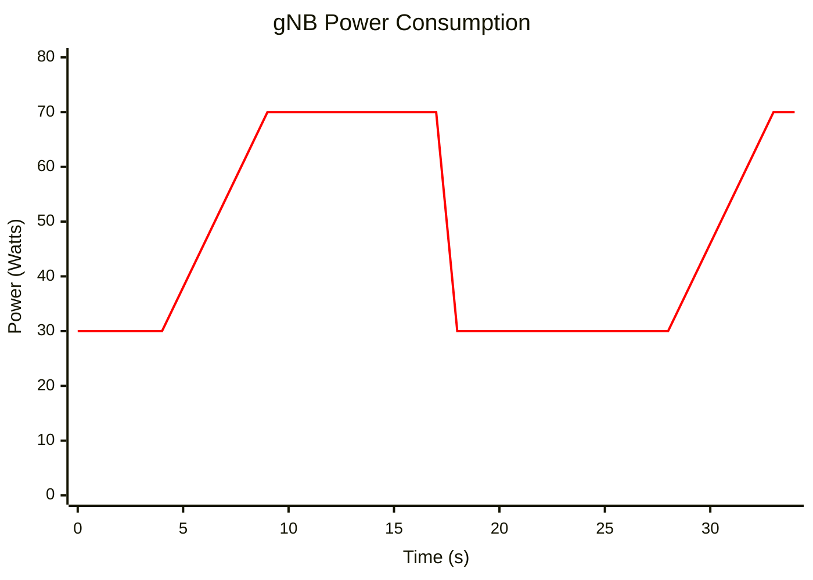
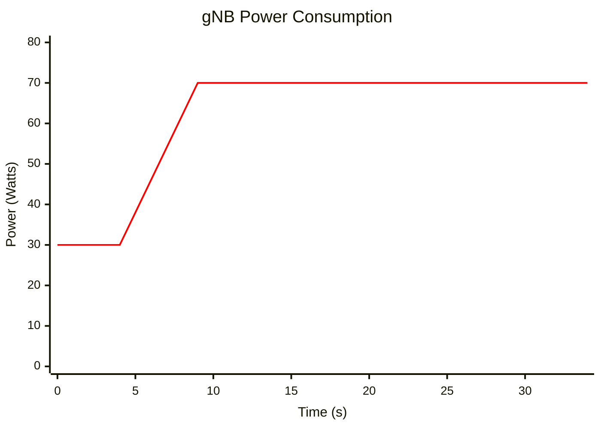
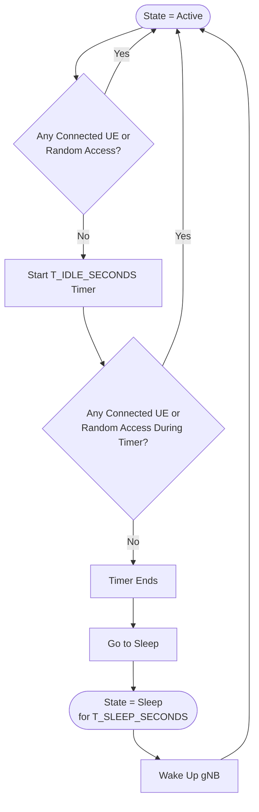
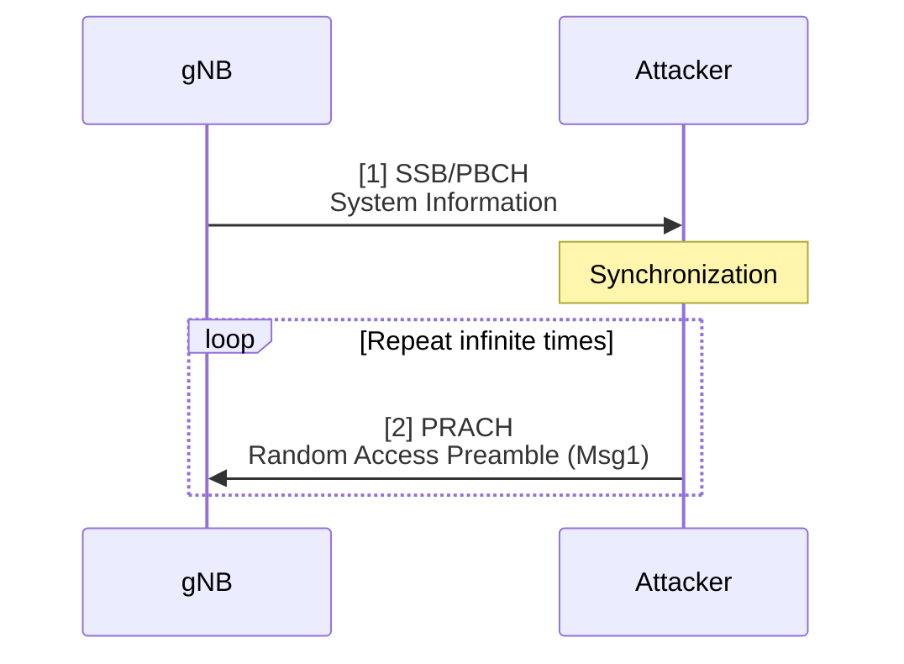
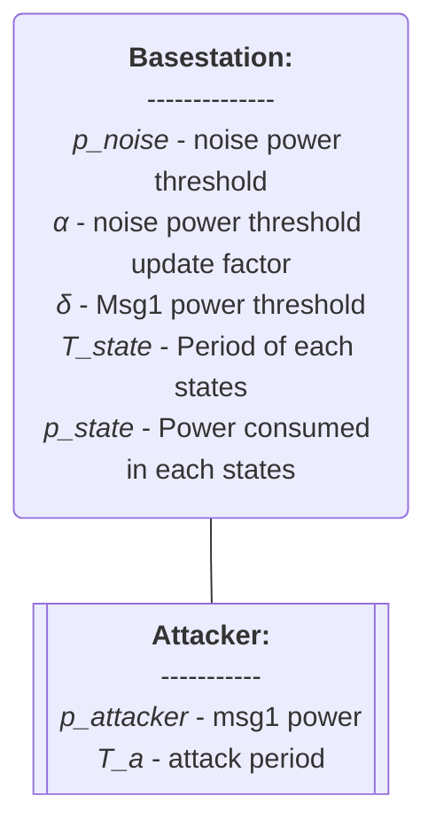
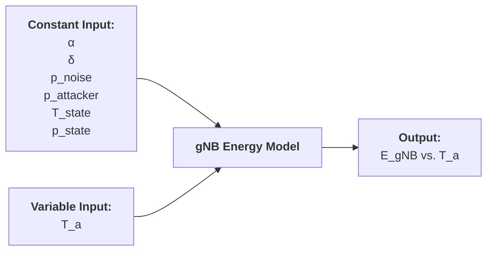

# Thesis (Basic Energy Saving Model)

###### tags: `2025`

**Goal:**
- [x] Write Basic Energy Saving Model for Analysis of PRACH Attack on Network Energy Saving

**References:**
- [A Power Consumption Model and Energy Saving Techniques for 5G-Advanced Base Stations](https://ieeexplore.ieee.org/document/10283643)

**Table of Contents:**
<small><i><a href='http://ecotrust-canada.github.io/markdown-toc/'>Table of contents generated with markdown-toc</a></i></small>

## 1. System Model

### 1.1. Power Saving Overview
#### 1.1.1. Normal Cycle


<!--
    bar [0, 0, 0, 0, 7500, 7500, 7500, 0, 0, 0, 0, 7500, 7500, 7500, 0]
-->

#### 1.1.2. Attacked Cycle




### 1.2. Timing Diagram

```mermaid
---
displayMode: compact
---
gantt
    dateFormat mm
    title gNB Power Levels at Different Periods
    axisFormat %M
    section Time Period
    Idle : done, gnb1, 00, 15m
    Up : done, gnb2, 15, 10m
    Active : done, gnb3, 25, 15m
    Down : done, gnb4, 40, 5m
    section Power at Active
    ‎7500 : crit, act1, 25, 15m
    section Power at Transition
    ‎Up : trans1, 15, 10m
    ‎Down : trans2, 40, 5m
    section Power at Idle
    ‎6500 : active, idl1, 00, 15m
```



### 1.3. Sleep Logic

<!--
```mermaid
flowchart LR
    Active[Active Mode]
    ActiveIdle[Idle Mode]
    Sleep[Sleep Mode]

    Start([Start]) -- Active
    Active --|No UE activity<br/>and no RA attempt| ActiveIdle
    ActiveIdle --|UE activity<br/>or RA attempt| Active
    ActiveIdle --|Idle timer expires| Sleep
    Sleep --|Sleep timer expires| Active

    %% Fake self-loops via invisible nodes
    ActiveLoop(( )) -- Active
    Active --|UE activity<br/>or RA attempt| ActiveLoop

    SleepLoop(( )) -- Sleep
    Sleep --|Sleep timer<br/>still running| SleepLoop
```
-->

<!--
```plantuml
@startuml
left to right direction
skinparam roundcorner 50
skinparam defaultTextAlignment center
skinparam backgroundColor #ffffff
skinparam activity {
  BackgroundColor #e3f2fd
  BorderColor #1565c0
  FontColor black
  FontSize 14
  BorderThickness 2
}

[*] -- Active

' Transitions
Active -- ActiveIdle : No UE\nand no RA
ActiveIdle -- Active : UE activity\nor RA attempt
ActiveIdle -- Sleep : Idle timer expires
Sleep -- Active : Sleep timer expires

' Self loops (clean arcs)
Active -- Active : UE activity\nor RA attempt
Sleep -- Sleep : Sleep timer\nnot yet over
@enduml
```
-->




### 1.4. Attack Message Sequence Chart



### 1.5. Actors



## 2. Basic Model

### 2.1. Model Parameters

#### 2.1.1. Assumptions or Constant Input Parameter

| Parameter      | Description                    | Constant Value |
| -------------- | ------------------------------ | -------------- |
| $\alpha$  | Noise update factor parameter                                                                       | 0..1 (real)    |
| $\delta$  | Msg1 to Noise dB Threshold                                                                       | 0..∞ (real)    |
| $p_{noise}$    | Initial Noise dB Threshold     | (real)         |
| $p_{attacker}$ | Attacker's Msg1 dB Power       | (real)         |
| $T_{state}$ | Period of each state in gNB energy saving mechanism       | (real)         |
| $p_{state}$ | Power consumed in each state in gNB energy saving mechanism       | (real)         |

#### 2.1.2. Variable Input Parameter

| Parameter | Description                                                                                         | Value Range    |
| --------- | --------------------------------------------------------------------------------------------------- | -------------- |
| $T_a$     | Variability of Attack Period                                                                        | 0..∞ (integer) |

#### 2.1.3. Output Parameter or Performance Metrics

| Parameter | Description                          | Value Range |
| --------- | ------------------------------------ | ----------- |
| $E_{gNB}$     | gNB's total energy consumption evaluate for 1 cycle of energy saving mechanism period | 0..∞ (real)      |



### 2.2. Model Equation
1. In normal operation (no attack), one complete cycle has 4 states:
```math
state =
\begin{cases}
active \\
transition,down \\
sleep \\
transition,up
\end{cases}
```
2. Total energy per cycle:
```math
E_{cycle} = E_{active} + E_{transition,down} + E_{sleep} + E_{transition,up}
```
```math
E_{cycle} = \sum_{state} E_{state}
```
3. Power per state:
```math
P_{\text{active}}(t) = P_{\text{active}}, \quad 0 \leq t < T_{\text{active}}
```
```math
P_{\text{sleep}}(t) = P_{\text{sleep}}, \quad 0 \leq t < T_{\text{sleep}}
```
```math
P_{\text{trans,down}}(t) = P_{\text{active}} + m_{\text{down}} \cdot t, \quad 0 \leq t < T_{\text{transition,down}}
```
```math
m_{\text{down}} = \frac{P_{\text{sleep}} - P_{\text{active}}}{T_{\text{transition,down}}} < 0
```
```math
P_{\text{trans,up}}(t) = P_{\text{sleep}} + m_{\text{up}} \cdot t, \quad 0 \leq t < T_{\text{transition,up}}
```
```math
m_{\text{up}} = \frac{P_{\text{active}} - P_{\text{sleep}}}{T_{\text{transition,up}}} > 0
```
4. Total energy per state
```math
E_{\text{state}} = \int_0^{T_{\text{state}}} P_{\text{state}}(t) \, dt
```
5. Total time of one cycle:
```math
T_{cycle} = T_{active} + T_{transition,down} + T_{sleep} + T_{transition,up}
```
6. Total energy if gNB is always active
```math
E_{alwaysActive} = P_{active} * T_{cycle}
```
7. gNB energy:
```math
E_{gNB} =
\begin{cases}
E_{cycle}  & \text{, if } P_{attacker} < (P_{th,\infty} + \delta) \\
E_{alwaysActive} & \text{, otherwise} 
\end{cases}
```
8. Noise threshold at infinity:
```math
P_{th,\infty} = (1 - \alpha) * P_{th,\infty - 1} + \alpha * P_{measured,\infty - 1}
```
```math
P_{th,\infty} = \langle P_{measured} \rangle 
```
9. Average of $P_{measured}$:
```math
\langle P_{\text{measured}} \rangle = \frac{1}{T_a} P_{attacker} + \frac{T_a - 1}{T_a} P_{noise}
```

### 2.3. Model Implementation in Python Code

#### 2.3.1. Parameters

| Parameter                | Description                                       | Value      |
| ------------------------ | ------------------------------------------------- | ---------- |
| \$P\_{noise}\$           | Measured background noise power at gNB (dB)       | 21.1       |
| \$P\_{attacker}\$        | Attacker's Msg1 power at gNB (dB)                 | 51         |
| \$\alpha\$               | Noise update factor (threshold updating speed)    | 0.12       |
| \$\delta\$               | Margin of noise threshold for Msg1 detection (dB) | 12         |
| \$T\_a\$                 | Attacker’s Msg1 transmission period (in RO)       | 1, 2, 16 |
| \$P\_{active}\$          | Power consumption during active state (W)        | 7.92        |
| \$P\_{sleep}\$           | Power consumption during sleep state (W)         | 6.38        |
| \$P\_{transition,up}\$   | Power consumption during up transition (W)       | 7.15        |
| \$P\_{transition,down}\$ | Power consumption during down transition (W)     | 7.15        |
| \$T\_{active}\$          | Duration of active state per cycle (s)           | 4         |
| \$T\_{sleep}\$           | Duration of sleep state per cycle (s)            | 7        |
| \$T\_{transition,up}\$   | Duration of up transition per cycle (s)          | 2         |
| \$T\_{transition,down}\$ | Duration of down transition per cycle (s)        | 7         |
| \$T\_{cycle}\$           | Total cycle duration (s)                         | 20        |


#### 2.3.2. Code

```python
import matplotlib.pyplot as plt
import numpy as np

# Parameters
P_noise = 21.1
P_attacker = 51
alpha = 0.12
delta = 12
P_active = 7.92
P_sleep = 6.38
T_active = 4
T_sleep = 7
T_transition_up = 2
T_transition_down = 7
T_cycle = 20
Ta_values = [1, 2, 16]

# Slope transitions
def transition_power(start_power, end_power, duration, time_in_state):
    return start_power + (end_power - start_power) * (time_in_state / duration)

def avg_measured_power(Ta):
    return (1 / Ta) * P_attacker + ((Ta - 1) / Ta) * P_noise

def can_gnb_sleep(Ta):
    P_th_infty = avg_measured_power(Ta)
    return P_attacker < (P_th_infty + delta)

def total_energy(Ta):
    if can_gnb_sleep(Ta):
        # Calculate energy with slope transitions
        E_active = P_active * T_active
        E_sleep = P_sleep * T_sleep

        # Transition down (average power)
        E_trans_down = ((P_active + P_sleep) / 2) * T_transition_down
        # Transition up (average power)
        E_trans_up = ((P_sleep + P_active) / 2) * T_transition_up

        return E_active + E_trans_down + E_sleep + E_trans_up
    else:
        return P_active * T_cycle

total_energies = [total_energy(Ta) for Ta in Ta_values]

time_points = np.arange(0, T_cycle, 0.1)
power_profiles = []

for Ta in Ta_values:
    profile = []
    if can_gnb_sleep(Ta):
        for t in time_points:
            if t < T_active:
                profile.append(P_active)
            elif t < T_active + T_transition_down:
                t_in_transition = t - T_active
                p = transition_power(P_active, P_sleep, T_transition_down, t_in_transition)
                profile.append(p)
            elif t < T_active + T_transition_down + T_sleep:
                profile.append(P_sleep)
            elif t < T_cycle:
                t_in_transition = t - (T_active + T_transition_down + T_sleep)
                p = transition_power(P_sleep, P_active, T_transition_up, t_in_transition)
                profile.append(p)
    else:
        profile = [P_active] * len(time_points)
    power_profiles.append(profile)

# Plotting
fig, axes = plt.subplots(1, 2, figsize=(12, 6))

# Bar chart
axes[0].bar(['Ta=1', 'Ta=2', 'Ta=16'], total_energies, color=['#1f77b4', '#ff7f0e', '#2ca02c'])
axes[0].set_title('Total Energy Consumption per Cycle')
axes[0].set_ylabel('Energy (J)')
axes[0].set_ylim([0, max(total_energies) * 1.2])

# Line chart
for idx, Ta in enumerate(Ta_values):
    axes[1].plot(time_points, power_profiles[idx], label=f'Ta={Ta}', linewidth=2)
axes[1].set_title('Power Consumption Profile in a Cycle')
axes[1].set_xlabel('Time (s)')
axes[1].set_ylabel('Power (W)')
axes[1].legend()
axes[1].grid(True)

plt.tight_layout()
plt.show()
```

#### 2.3.3. Result


