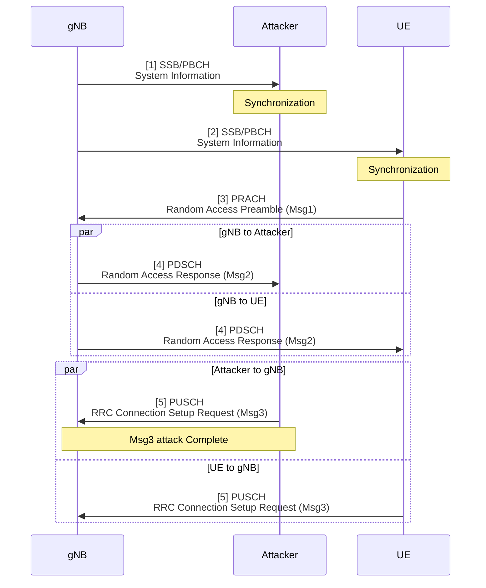
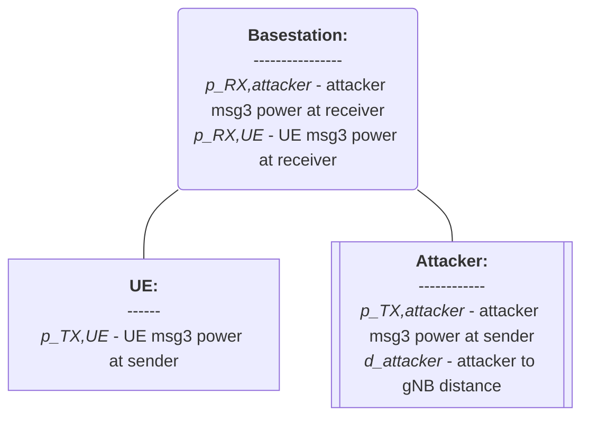
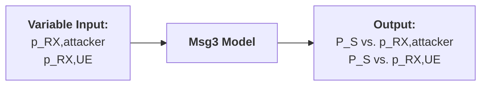
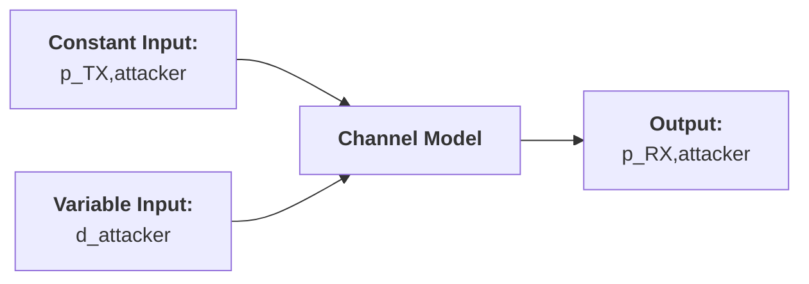

# Thesis (Basic Msg3 Model)

###### tags: `2025`

**Goal:**
- [x] Write Basic Msg3 Model for Analysis of PRACH Attack on Network Energy Saving

**References:**
- Modeling Random Access with Capture and Power Control for IEEE 802.11be Systems
- [Modeling and Estimation of One-Shot Random Access for Finite-User Multichannel Slotted ALOHA Systems](https://ieeexplore.ieee.org/document/6211364)
- [20250307 Thesis (PRACH Attack Problem Definition)](https://github.com/bmw-ece-ntust/wilfrid-prach-attack-analysis/blob/master/docs/20250307%20Thesis%20(PRACH%20Attack%20Problem%20Definition).md)
- [Wireless Communications: Principles and Practice](https://www.amazon.com/Wireless-Communications-Principles-Practice-2nd/dp/0130422320)

**Table of Contents:**
<small><i><a href='http://ecotrust-canada.github.io/markdown-toc/'>Table of contents generated with markdown-toc</a></i></small>

## 1. System Model

### 1.2. PRACH Msg3 Attack Overview


### 1.2. Actors



## 2. Basic Model

### 2.1. Model Parameters

#### 2.1.1. Assumptions or Constant Input Parameter

- No Constant Input

#### 2.1.2. Variable Input Parameter

| Parameter | Description                                                                                         | Value Range    |
| --------- | --------------------------------------------------------------------------------------------------- | -------------- |
| $p_{RX,attacker}$     | Attacker's Msg3 dB Power                                                                        | -∞..∞ (integer) |
| $p_{RX,UE}$       | UE's Msg3 dB Power             | -∞..∞ (integer)         |

#### 2.1.3. Output Parameter or Performance Metrics

| Parameter | Description                          | Value Range |
| --------- | ------------------------------------ | ----------- |
| $P_S$     | UE's Msg3 Access Success Probability | 0..1      |



### 2.2. Model Equation

1. UE's Msg3 Success is:
```math
P_{S} = \frac{1}{1+e^{\left(p_{RX,attacker}-p_{RX,UE}\right)}}
```

### 2.3. Model Implementation in Python Code

#### 2.3.1. Parameters

| Parameter      | Description                                                              | Value   |
| -------------- | ------------------------------------------------------------------------ | ------- |
| $P_{attacker}$ | Attacker's Msg3 dB Power                                                 | 860..1020      |
| $P_{UE}$       | UE's Msg3 dB Power                                                       | 820, 860, 900      |


#### 2.3.2. Code

```python
import numpy as np
import matplotlib.pyplot as plt

# Define the given parameters
P_UE_values = [820, 860, 900]  # Different values of P_UE to compare
P_attacker_values = np.linspace(700, 1020, 200)  # Range of P_attacker from 700 to 1020 (200 points)

# Define the sigmoid function P_S based on the equation
def calculate_P_S(P_attacker, P_UE):
    return 1 / (1 + np.exp(P_attacker - P_UE))

# Plotting the results for different P_UE values
plt.figure(figsize=(8, 6))

# Loop through each P_UE value and plot the corresponding P_S
for P_UE in P_UE_values:
    P_S_values = calculate_P_S(P_attacker_values, P_UE)
    plt.plot(P_attacker_values, P_S_values, label=f"$P_{{UE}} = {P_UE}$ dB")

# Display the plot with labels and title
plt.xlabel(r"$P_{attacker}$ (dB)")
plt.ylabel(r"$P_S$")
plt.title("Sigmoid Output $P_S$ vs Attacker's Power $P_{attacker}$ for Different $P_{UE}$ Values")
plt.grid(True)
plt.legend()
plt.show()
```

#### 2.3.3. Result


## 3. Add UE and Attacker Channel Model

**Notes:**
1. Parameters and Equation are referenced from [Wireless Communications: Principles and Practice](https://www.amazon.com/Wireless-Communications-Principles-Practice-2nd/dp/0130422320)

### 3.1. Model Parameters

#### 3.1.1. Assumptions or Constant Input Parameter

| Parameter      | Description              | Constant Value |
| -------------- | ------------------------ | -------------- |
| $P_{TX,UE}$       | UE's Msg1 dB Power (tx by UE)        | (real) |
| $P_{TX,attacker}$ | Attacker's Msg1 dB Power (rx by gNB) | (real) |

#### 3.1.2. Variable Input Parameter

| Parameter         | Description                          | Value Range |
| ----------------- | ------------------------------------ | ----------- |
| $d_{UE}$          | distance between gNB to UE           | 0..∞ (real) |
| $d_{attacker}$    | distance between gNB to attacker     | 0..∞ (real) |

#### 3.1.3. Output Parameter or Performance Metrics

| Parameter      | Description                          | Value Range |
| -------------- | ------------------------------------ | ----------- |
| $P_{RX,attacker}$ | Attacker's Msg1 dB Power (rx by gNB) | 0..∞ (real) |
| $P_{RX,UE}$       | UE's Msg1 dB Power (rx by gNB)       | 0..∞ (real) |



### 3.2. Equation

1. UE to gNB Channel Model:
- UE will estimate TX power so that UE RX power on gNB side will be around `preambleReceivedTargetPower` dB for Msg1
- Since Msg3 power is `preambleReceivedTargetPower` + `msg3-DeltaPreamble`, UE distance to Msg3 power is not related (except for very far UE which will not be considered)

2. Attacker to gNB Channel Model
```math
p_{RX,attacker} = p_{TX,attacker} - PL
```
Path Loss can be modeled as
```math
PL = 10 \times \gamma \times log( d_{attacker})
```


### 3.3. Modify Code to Add UE and Attacker Channel Model

#### 3.3.1. Parameters

| Parameter         | Description                          | Value       |
| ----------------- | ------------------------------------ | ----------- |
| $\gamma$          | path loss exponent                   | 1.92         |
| $d_{UE}$          | distance between gNB to UE           | 90,127,165           |
| $d_{attacker}$    | distance between gNB to attacker     | 1           |
| $P_{UE}$       | UE's Msg3 dB Power (RX by gNB)        | 50          |
| $P_{attacker,TX}$ | Attacker's Msg1 dB Power (tx by attacker) | 97.5          |

#### 3.3.2. Code

```python
import numpy as np
import matplotlib.pyplot as plt

# Parameters
d_UE_values = [90, 127, 165]  # in meters (not used in this simplified model)
P_UE_dB = 50  # Msg3 power in dB received at gNB
P_attacker_TX_dB = 97.5  # Attacker's TX power in dB
gamma = 1.92  # Path loss exponent
alpha = 5 # Steepness of curve

# Distance range for attacker [1, 450] meters (log range)
d_attacker_values = np.linspace(1, 450, 449)

# Compute received power from attacker in dB
def calculate_P_attacker_dB(d_attacker):
    return P_attacker_TX_dB - 10 * gamma * np.log10(d_attacker)

# Sigmoid function in dB domain
def calculate_P_S(P_attacker_dB, P_UE_dB, alpha):
    return 1 / (1 + np.exp(alpha * (P_attacker_dB - P_UE_dB)))

# Compute attacker power and P_S
P_attacker_dB_values = calculate_P_attacker_dB(d_attacker_values)
P_S_values = calculate_P_S(P_attacker_dB_values, P_UE_dB, alpha)

# Plotting
fig, axs = plt.subplots(1, 2, figsize=(14, 6))

# Left plot: P_S vs. d_attacker
axs[0].plot(d_attacker_values, P_S_values, color='blue', label=f"$P_{{UE}} = {P_UE_dB}$ dB")
axs[0].set_xlabel(r"$d_{attacker}$ (meters)")
axs[0].set_ylabel(r"$P_S$")
axs[0].set_title(r"$P_S$ vs. Attacker Distance $d_{attacker}$")
axs[0].grid(True)
axs[0].legend()

# Right plot: P_attacker vs. d_attacker
axs[1].plot(d_attacker_values, P_attacker_dB_values, color='black', label=r"$P_{attacker}^{Rx}$")
axs[1].axhline(P_UE_dB, color='red', linestyle='--', linewidth=1, label=f"$P_{{UE}} = {P_UE_dB}$ dB")
axs[1].set_xlabel(r"$d_{attacker}$ (meters)")
axs[1].set_ylabel(r"$P_{attacker}^{Rx}$ (dB)")
axs[1].set_title(r"Attacker Received Power vs. Distance")
axs[1].grid(True)
axs[1].legend()

plt.tight_layout()
plt.show()
```

#### 3.3.3. Result


