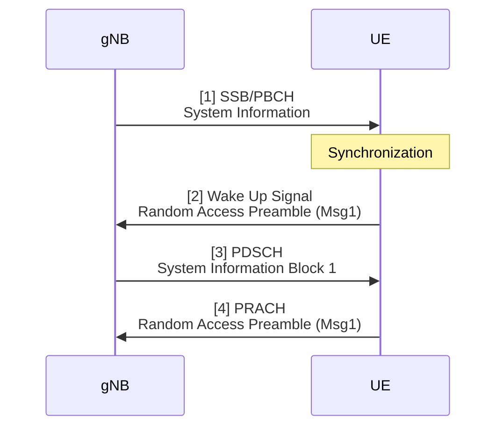
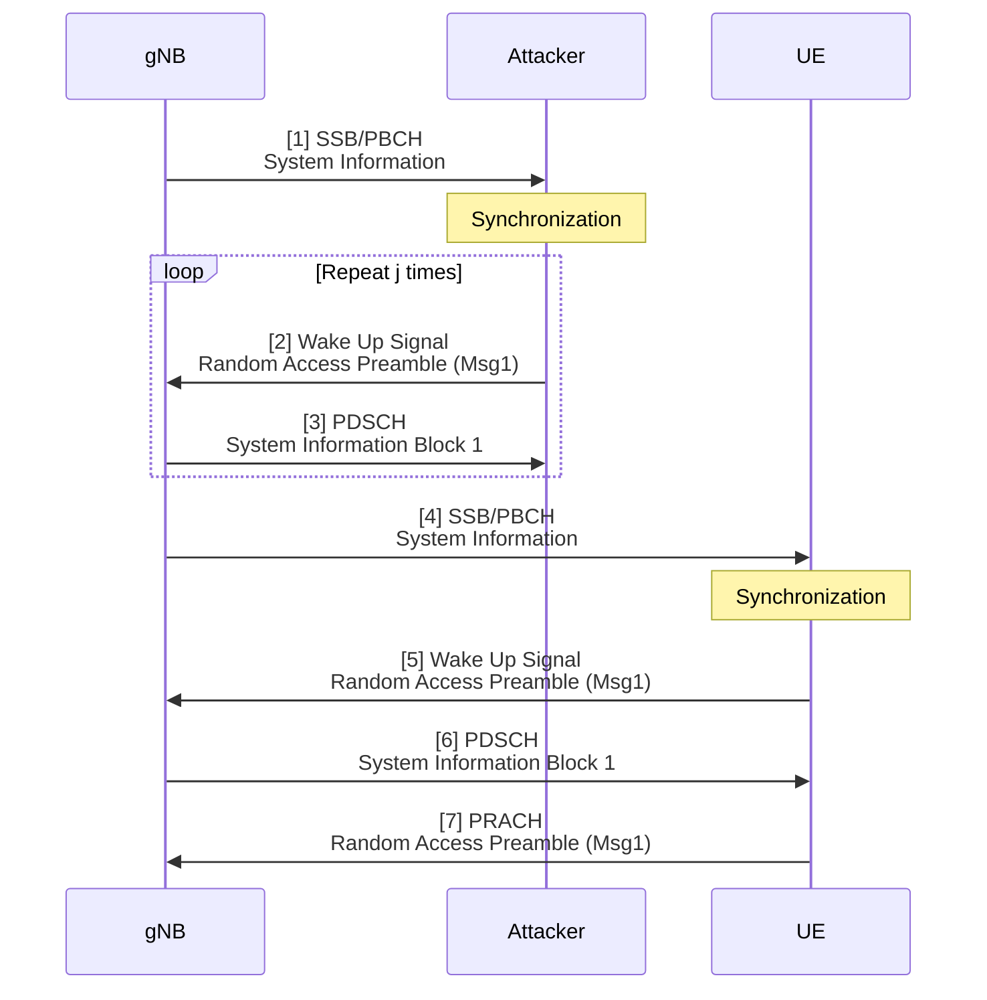

# Thesis (Basic SIB1 Model)

###### tags: `2025`

**Goal:**
- [x] Write Basic SIB1 Model for Analysis of PRACH Attack on Network Energy Saving

**References:**
- [A Power Consumption Model and Energy Saving Techniques for 5G-Advanced Base Stations](https://ieeexplore.ieee.org/document/10283643)

**Table of Contents:**
<small><i><a href='http://ecotrust-canada.github.io/markdown-toc/'>Table of contents generated with markdown-toc</a></i></small>

## 1. System Model

### 1.2. PRACH Msg3 Attack Overview

#### 1.2.1. Normal

#### 1.2.2. Under Attack

### 1.2. Actors

## 2. Basic Model

### 2.1. Model Parameters

#### 2.1.1. Assumptions or Constant Input Parameter
