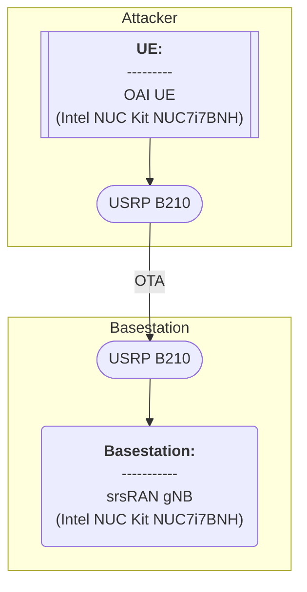

# Thesis (Test of Msg1 PRACH Attacker for srsRAN)

###### tags: `2025`


**Goal:**
- [x] [Test Msg1 PRACH Attacker for srsRAN]()

**References:**
- [srsRAN Project Installation Guide](https://docs.srsran.com/projects/project/en/latest/user_manuals/source/installation.html)
- [srsRAN 4G Installation Guide](https://docs.srsran.com/projects/4g/en/latest/general/source/1_installation.html)
- [Attacker guide for Wilfrid paper](https://ntust-bmwlab.notion.site/Attacker-guide-for-Wilfrid-paper-12d1009831438064b6afcf322b4fa252)
- [MTK UE Guide](https://github.com/bmw-ece-ntust/o-ran-docs/blob/2022-MS-Summer-OAI/UE/MTK%20UE/MTK%20UE%20Guide.md)

**Table of Contents:**
- [Thesis (Test of Msg1 PRACH Attacker for srsRAN)](#thesis--test-of-msg1-prach-attacker-for-srsran-)
          + [tags: `2025`](#tags---2025-)
  * [0. Summary](#0-summary)
  * [1. srsRAN gNB and srsUE](#1-srsran-gnb-and-srsue)
    + [1.0. Minimum Requirement](#10-minimum-requirement)
      - [1.0.1. srsRAN gNB with USRP](#101-srsran-gnb-with-usrp)
      - [1.0.2. srs4G UE with USRP](#102-srs4g-ue-with-usrp)
    + [1.1. Topology](#11-topology)
    + [1.2. Environment](#12-environment)
      - [1.2.1. srsRAN gNB](#121-srsran-gnb)
      - [1.2.2. srs4G UE](#122-srs4g-ue)
    + [1.3. Compile](#13-compile)
      - [1.3.1. Compile gNB](#131-compile-gnb)
      - [1.3.2. Compile srs4G UE](#132-compile-srs4g-ue)
    + [1.4. Run](#14-run)
      - [1.4.1. Configuration](#141-configuration)
        * [1.4.1.1. gNB Configuration](#1411-gnb-configuration)
        * [1.4.1.2. srs4G UE Configuration](#1412-srs4g-ue-configuration)
      - [1.4.2. Result](#142-result)
        * [1.4.2.1. Initial Run](#1421-initial-run)
  * [2. srsRAN gNB and OAI UE](#2-srsran-gnb-and-oai-ue)
    + [2.0. Minimum Requirement](#20-minimum-requirement)
      - [2.0.1. srsRAN gNB with USRP](#201-srsran-gnb-with-usrp)
      - [2.0.2. OAI UE with USRP for attacker](#202-oai-ue-with-usrp-for-attacker)
    + [2.1. Topology](#21-topology)
    + [2.2. Environment](#22-environment)
      - [2.2.1. srsRAN gNB](#221-srsran-gnb)
      - [2.2.2. OAI UE](#222-oai-ue)
    + [2.3. Compile](#23-compile)
      - [2.3.1. Compile gNB](#231-compile-gnb)
      - [2.3.2. Compile OAI UE for attacker](#232-compile-oai-ue-for-attacker)
    + [2.4. Run](#24-run)
      - [2.4.1. Configuration](#241-configuration)
        * [2.4.1.1. gNB Configuration](#2411-gnb-configuration)
        * [2.4.1.2. OAI UE Configuration](#2412-oai-ue-configuration)
      - [2.4.2. Result](#242-result)
        * [2.4.2.1. Initial Run](#2421-initial-run)

<small><i><a href='http://ecotrust-canada.github.io/markdown-toc/'>Table of contents generated with markdown-toc</a></i></small>

## 0. Summary

1. abc

## 1. srsRAN gNB and srsUE

| Step                        | Status             |
| --------------------------- | ------------------ |
| gNB Run                     | :heavy_check_mark: |
| [UE Run and Send Msg1 to gNB](#1421-initial-run)   | :heavy_check_mark: |

### 1.0. Minimum Requirement

- [Source]()

#### 1.0.1. srsRAN gNB with USRP

<b>Hardware:</b>

| Item   | Info       |
| ------ | ---------- |
| CPU    |  |
| Memory |         |

<b>Software:</b>

| Item | Info            |
| ---- | --------------- |
| OS   |  |

#### 1.0.2. srs4G UE with USRP

<b>Hardware:</b>

| Item   | Info       |
| ------ | ---------- |
| CPU    |  |
| Memory |         |

<b>Software:</b>

| Item | Info            |
| ---- | --------------- |
| OS   |  |

### 1.1. Topology


### 1.2. Environment

#### 1.2.1. srsRAN gNB

<b>Hardware:</b>

| Item         | Info                                     |
| ------------ | ---------------------------------------- |
| CPU          | Intel(R) Core(TM) i7-7567U CPU @ 3.50GHz |
| Memory       | 8GB                                      |
| Disk         | 922GB                                    |
| Server Model | Intel Corporation NUC7i7BNH J31153-310   |

Command Line Codes
```shell=
# Check CPU Type, freq, cores, numbers
lscpu

# Check total memory
sudo lshw -C memory

# Check total disk
df -h
df --total -h | grep 'total' | awk '{print $2}'

# Check server model
sudo dmidecode -t system
```

<b>Software:</b>

| Item       | Info                       |
| ---------- | -------------------------- |
| OS         | Ubuntu 22.04.4 LTS (jammy) |
| Kernel     | 6.8.0-52-generic           |
| srsRAN Commit | 2be82d8ea38e3a729850b702254952c04118cc38 (HEAD -> main, origin/test, origin/main, origin/HEAD)                           |

Command Line Codes
```shell=
# Check OS
lsb_release -a

# Check kernel
uname -a
uname -r

# Check OAI commit
git log -1
```

#### 1.2.2. srs4G UE

<b>Hardware:</b>

| Item         | Info                                     |
| ------------ | ---------------------------------------- |
| CPU          | Intel(R) Core(TM) i7-7567U CPU @ 3.50GHz |
| Memory       | 8GB                                      |
| Disk         | 922GB                                    |
| Server Model |                                          |

Command Line Codes
```shell=
# Check CPU Type, freq, cores, numbers
lscpu

# Check total memory
sudo lshw -C memory

# Check total disk
df -h
df --total -h | grep 'total' | awk '{print $2}'

# Check server model
sudo dmidecode -t system
```


<b>Software:</b>

| Item       | Info                       |
| ---------- | -------------------------- |
| OS         | Ubuntu 22.04.4 LTS (jammy) |
| Kernel     | 6.8.0-52-generic           |
| OAI Commit | ec29b0c1ff79cebcbe66caa6d6b90778261c42b8 (HEAD -> master, origin/test, origin/master, origin/HEAD)                           |

Command Line Codes
```shell=
# Check OS
lsb_release -a

# Check kernel
uname -a
uname -r

# Check OAI commit
git log -1
```


### 1.3. Compile


#### 1.3.1. Compile gNB

<b>1. Install USRP B210 dependency</b>

```shell=
sudo apt install -y autoconf automake build-essential ccache cmake cpufrequtils doxygen ethtool g++ git inetutils-tools libboost-all-dev libncurses5 libncurses5-dev libusb-1.0-0 libusb-1.0-0-dev libusb-dev python3-dev python3-mako python3-numpy python3-requests python3-scipy python3-setuptools python3-ruamel.yaml
```

<b>2. Build UHD from source</b>

```shell=
git clone https://github.com/EttusResearch/uhd.git
cd uhd
git checkout v4.6.0.0
cd host
mkdir build
cd build
cmake ../
make -j $(nproc)
make test # This step is optional
sudo make install
sudo ldconfig
```

<b>3. Download FPGA Image</b>

```shell=
sudo uhd_images_downloader
```

<b>4. Install Gnuradio</b>

```shell=
sudo apt install gnuradio
```

<b>5. Check if the system can recognise B210 through USB</b>

```shell=
lsusb
```


<b>6. Test the device with uhd to see if it works</b>

```shell=
sudo uhd_find_devices
```


<b>7. Dependency</b>

```shell=
sudo apt-get install cmake make gcc g++ pkg-config libfftw3-dev libmbedtls-dev libsctp-dev libyaml-cpp-dev libgtest-dev
```


<b>8. Download srsRAN gNB from github</b>

```shell=
git clone https://github.com/srsRAN/srsRAN_Project.git
```


<b>10. Build srsRAN gNB</b>

```shell=
cd srsRAN_Project
mkdir build
cd build
cmake ../
make -j $(nproc)
make test -j $(nproc)
```


#### 1.3.2. Compile srs4G UE

<b>1. Install USRP B210 dependency</b>

```shell=
sudo apt install -y autoconf automake build-essential ccache cmake cpufrequtils doxygen ethtool g++ git inetutils-tools libboost-all-dev libncurses5 libncurses5-dev libusb-1.0-0 libusb-1.0-0-dev libusb-dev python3-dev python3-mako python3-numpy python3-requests python3-scipy python3-setuptools python3-ruamel.yaml
```

<b>2. Build UHD from source</b>

```shell=
git clone https://github.com/EttusResearch/uhd.git
cd uhd
git checkout v4.6.0.0
cd host
mkdir build
cd build
cmake ../
make -j $(nproc)
make test # This step is optional
sudo make install
sudo ldconfig
```

<b>3. Download FPGA Image</b>

```shell=
sudo uhd_images_downloader
```

<b>4. Install Gnuradio</b>

```shell=
sudo apt install gnuradio
```

<b>5. Check if the system can recognise B210 through USB</b>

```shell=
lsusb
```


<b>6. Test the device with uhd to see if it works</b>

```shell=
sudo uhd_find_devices
```


<b>7. Download and build srsRAN 4G</b>

```shell=
git clone https://github.com/srsRAN/srsRAN_4G.git
cd srsRAN_4G
mkdir build
cd build
cmake ../
make
make test
```


### 1.4. Run

#### 1.4.1. Configuration

##### 1.4.1.1. gNB Configuration

<b>1. We use example configuration from `srsRAN_Project/configs/gnb_rf_b210_fdd_srsUE.yml`</b>

<b>2. Be aware that you might need to change 4 things in the configuration file:</b>
- AMF and Network Interface Parameters (modify as your AMF and gNB ip address. Values that I use is below)
```shell=
amf:
    addr: 192.168.8.108                 # The address or hostname of the AMF. Check Open5GS config -> amf -> ngap -> addr
    port: 38412
    bind_addr: 192.168.8.59            # A local IP that the gNB binds to for traffic from the AMF.
```
- PLMN List (modify as your desired Slice Configuration. Values that I use is below)
```shell=
    supported_tracking_areas:
      - tac: 1
        plmn_list:
          - plmn: "00101"
            tai_slice_support_list:
              - sst: 1
```
- RF front-end device (modify as your desired RF front-end device. Values that I use is below)
```shell=
ru_sdr:
  device_driver: uhd                # The RF driver name.
  device_args: type=b200            # Optionally pass arguments to the selected RF driver.
  #clock: internal                   # Use internal reference clock with USRP B210.
  srate: 23.04                      # RF sample rate might need to be adjusted according to selected bandwidth.
  tx_gain: 80                       # Transmit gain of the RF might need to adjusted to the given situation.
  rx_gain: 40                       # Receive gain of the RF might need to adjusted to the given situation.
```
- 5G Cell Parameters (modify as your desired 5G Cell Parameters. Values that I use is below)
```shell=
cell_cfg:
  dl_arfcn: 368500                  # ARFCN of the downlink carrier (center frequency).
  band: 3                           # The NR band.
  channel_bandwidth_MHz: 20         # Bandwith in MHz. Number of PRBs will be automatically derived.
  common_scs: 15                    # Subcarrier spacing in kHz used for data.
  plmn: "00101"                     # PLMN broadcasted by the gNB.
  tac: 1                            # Tracking area code (needs to match the core configuration).
  pdcch:
    common:
      ss0_index: 0                  # Set search space zero index to match srsUE capabilities
      coreset0_index: 12            # Set search CORESET Zero index to match srsUE capabilities
    dedicated:
      ss2_type: common              # Search Space type, has to be set to common
      dci_format_0_1_and_1_1: false # Set correct DCI format (fallback)
  prach:
    prach_config_index: 1           # Sets PRACH config to match what is expected by srsUE
  pdsch:
    mcs_table: qam64
  pusch:
    mcs_table: qam64
```

<b>3. Remember that the config file is also located at the same directory as the gNB</b>


##### 1.4.1.2. srs4G UE Configuration

<b>1. We use example configuration from the `srsRAN gNB with srsUE` guide</b>

<b>2. Below is the content of the configuration file:</b>

```shell=
[rf]
freq_offset = 0
tx_gain = 50
rx_gain = 40
srate = 23.04e6
nof_antennas = 1

device_name = uhd
device_args = clock=external
time_adv_nsamples = 300

[rat.eutra]
dl_earfcn = 2850
nof_carriers = 0

[rat.nr]
bands = 3
nof_carriers = 1
max_nof_prb = 106
nof_prb = 106

[pcap]
enable = none
mac_filename = /tmp/ue_mac.pcap
mac_nr_filename = /tmp/ue_mac_nr.pcap
nas_filename = /tmp/ue_nas.pcap

[log]
all_level = info
phy_lib_level = none
all_hex_limit = 32
filename = /tmp/ue.log
file_max_size = -1

[usim]
mode = soft
algo = milenage
opc  = 63BFA50EE6523365FF14C1F45F88737D
k    = 00112233445566778899aabbccddeeff
imsi = 001010123456780
imei = 353490069873319

[rrc]
release = 15
ue_category = 4

[nas]
apn = srsapn
apn_protocol = ipv4

[gw]
#netns = ue1
#ip_devname = tun_srsue
#ip_netmask = 255.255.255.0

[gui]
enable = false
```

<b>3. Just adjust the tx_gain of the UE to be bigger and comment the external clock:</b>

```shell=
device_args = #clock=external

tx_gain = 80
```

<b>4. Remember that the config file is also located at the same directory as the srsue</b>


#### 1.4.2. Result

##### 1.4.2.1. Initial Run

<b>1. Run open5gs CN</b>

```shell=
sudo ./createtun.sh # not persistent after rebooting
./start_open5gs.sh
```


```shell=
screen -r amf
```


<b>2. Run srsRAN gNB</b>

```shell=
cd srsRAN_Project/build/apps/gnb
sudo ./gnb -c ./gnb.yaml
```


<b>3. Run srs4G UE</b>

```shell=
cd srsRAN_4G/build/srsue/src
sudo ./srsue ue_rf.conf
```


<b>4. Result explanation</b>
- We can see from gNB's Log, it receive srs4G UE's preamble with id = 1


## 2. srsRAN gNB and OAI UE

| Step                        | Status             |
| --------------------------- | ------------------ |
| gNB Run                     | :heavy_check_mark: |
| [UE Run and Send Msg1 to gNB](#2421-initial-run)   | :heavy_check_mark: |

### 2.0. Minimum Requirement

- [Source]()

#### 2.0.1. srsRAN gNB with USRP

<b>Hardware:</b>

| Item   | Info       |
| ------ | ---------- |
| CPU    |  |
| Memory |         |

<b>Software:</b>

| Item | Info            |
| ---- | --------------- |
| OS   |  |

#### 2.0.2. OAI UE with USRP for attacker

<b>Hardware:</b>

| Item   | Info       |
| ------ | ---------- |
| CPU    |  |
| Memory |         |

<b>Software:</b>

| Item | Info            |
| ---- | --------------- |
| OS   |  |

### 2.1. Topology



### 2.2. Environment

#### 2.2.1. srsRAN gNB

<b>Hardware:</b>

| Item         | Info                                     |
| ------------ | ---------------------------------------- |
| CPU          | Intel(R) Core(TM) i7-7567U CPU @ 3.50GHz |
| Memory       | 8GB                                      |
| Disk         | 922GB                                    |
| Server Model | Intel Corporation NUC7i7BNH J31153-310   |

Command Line Codes
```shell=
# Check CPU Type, freq, cores, numbers
lscpu

# Check total memory
sudo lshw -C memory

# Check total disk
df -h
df --total -h | grep 'total' | awk '{print $2}'

# Check server model
sudo dmidecode -t system
```

<b>Software:</b>

| Item       | Info                       |
| ---------- | -------------------------- |
| OS         | Ubuntu 22.04.4 LTS (jammy) |
| Kernel     | 6.8.0-52-generic           |
| srsRAN Commit | 2be82d8ea38e3a729850b702254952c04118cc38 (HEAD -> main, origin/test, origin/main, origin/HEAD)                           |

Command Line Codes
```shell=
# Check OS
lsb_release -a

# Check kernel
uname -a
uname -r

# Check OAI commit
git log -1
```

#### 2.2.2. OAI UE

<b>Hardware:</b>

| Item         | Info                                     |
| ------------ | ---------------------------------------- |
| CPU          | Intel(R) Core(TM) i7-7567U CPU @ 3.50GHz |
| Memory       | 8GB                                      |
| Disk         | 922GB                                    |
| Server Model |                                          |

Command Line Codes
```shell=
# Check CPU Type, freq, cores, numbers
lscpu

# Check total memory
sudo lshw -C memory

# Check total disk
df -h
df --total -h | grep 'total' | awk '{print $2}'

# Check server model
sudo dmidecode -t system
```


<b>Software:</b>

| Item       | Info                       |
| ---------- | -------------------------- |
| OS         | Ubuntu 22.04.4 LTS (jammy) |
| Kernel     | 6.8.0-52-generic           |
| OAI Commit | 59b419d31c0ed8d6bea975c087b06d77f7ce25d7 (HEAD, origin/develop, origin/HEAD, develop)                           |

Command Line Codes
```shell=
# Check OS
lsb_release -a

# Check kernel
uname -a
uname -r

# Check OAI commit
git log -1
```


### 2.3. Compile


#### 2.3.1. Compile gNB

<b>1. Install USRP B210 dependency</b>

```shell=
sudo apt install -y autoconf automake build-essential ccache cmake cpufrequtils doxygen ethtool g++ git inetutils-tools libboost-all-dev libncurses5 libncurses5-dev libusb-1.0-0 libusb-1.0-0-dev libusb-dev python3-dev python3-mako python3-numpy python3-requests python3-scipy python3-setuptools python3-ruamel.yaml
```

<b>2. Build UHD from source</b>

```shell=
git clone https://github.com/EttusResearch/uhd.git
cd uhd
git checkout v4.6.0.0
cd host
mkdir build
cd build
cmake ../
make -j $(nproc)
make test # This step is optional
sudo make install
sudo ldconfig
```

<b>3. Download FPGA Image</b>

```shell=
sudo uhd_images_downloader
```

<b>4. Install Gnuradio</b>

```shell=
sudo apt install gnuradio
```

<b>5. Check if the system can recognise B210 through USB</b>

```shell=
lsusb
```


<b>6. Test the device with uhd to see if it works</b>

```shell=
sudo uhd_find_devices
```


<b>7. Dependency</b>

```shell=
sudo apt-get install cmake make gcc g++ pkg-config libfftw3-dev libmbedtls-dev libsctp-dev libyaml-cpp-dev libgtest-dev
```


<b>8. Download srsRAN gNB from github</b>

```shell=
git clone https://github.com/srsRAN/srsRAN_Project.git
```


<b>10. Build srsRAN gNB</b>

```shell=
cd srsRAN_Project
mkdir build
cd build
cmake ../
make -j $(nproc)
make test -j $(nproc)
```


#### 2.3.2. Compile OAI UE for attacker

<b>1. Install USRP B210 dependency</b>

```shell=
sudo apt install -y autoconf automake build-essential ccache cmake cpufrequtils doxygen ethtool g++ git inetutils-tools libboost-all-dev libncurses5 libncurses5-dev libusb-1.0-0 libusb-1.0-0-dev libusb-dev python3-dev python3-mako python3-numpy python3-requests python3-scipy python3-setuptools python3-ruamel.yaml
```

<b>2. Build UHD from source</b>

```shell=
git clone https://github.com/EttusResearch/uhd.git
cd uhd
git checkout v4.6.0.0
cd host
mkdir build
cd build
cmake ../
make -j $(nproc)
make test # This step is optional
sudo make install
sudo ldconfig
```

<b>3. Download FPGA Image</b>

```shell=
sudo uhd_images_downloader
```

<b>4. Install Gnuradio</b>

```shell=
sudo apt install gnuradio
```

<b>5. Check if the system can recognise B210 through USB</b>

```shell=
lsusb
```


<b>6. Test the device with uhd to see if it works</b>

```shell=
sudo uhd_find_devices
```


<b>7. Clone MSG1 Attacker and checkout to rework_UE branch</b>

```shell=
git clone https://github.com/Richard-yq/OAI-UE-MSG1-attacker.git
cd  OAI-UE-MSG1-attacker
git checkout develop
```

<b>8. Install ASN.1</b>

```shell=
cd cmake_targets
sudo ./build_oai -I
```

<b>9. Install nrscope</b>

```shell=
sudo apt install -y libforms-dev libforms-bin
```

<b>10. Build the attacker as OAI UE</b>

```shell=
./build_oai -w USRP --ninja --nrUE --gNB --build-lib "nrscope" -C
```


### 2.4. Run

#### 2.4.1. Configuration

##### 2.4.1.1. gNB Configuration

<b>1. We use example configuration from `srsRAN_Project/configs/gnb_rf_b200_tdd_n78_20mhz.yml`</b>

<b>2. Be aware that you might need to change 4 things in the configuration file:</b>
- AMF and Network Interface Parameters (modify as your AMF and gNB ip address. Values that I use is below)
```shell=
amf:
    addr: 192.168.8.108                 # The address or hostname of the AMF. Check Open5GS config -> amf -> ngap -> addr
    port: 38412
    bind_addr: 192.168.8.59            # A local IP that the gNB binds to for traffic from the AMF.
```
- PLMN List (modify as your desired Slice Configuration. Values that I use is below)
```shell=
    supported_tracking_areas:
      - tac: 1
        plmn_list:
          - plmn: "00101"
            tai_slice_support_list:
              - sst: 1
```
- RF front-end device (modify as your desired RF front-end device. Values that I use is below)
```shell=
ru_sdr:
  device_driver: uhd
  device_args: type=b200,num_recv_frames=64,num_send_frames=64
  srate: 23.04
  otw_format: sc12
  tx_gain: 80
  rx_gain: 40
```
- 5G Cell Parameters (modify as your desired 5G Cell Parameters. Values that I use is below)
```shell=
cell_cfg:
  dl_arfcn: 640608                  # ARFCN of the downlink carrier (center frequency).
  band: 78                           # The NR band.
  channel_bandwidth_MHz: 20         # Bandwith in MHz. Number of PRBs will be automatically derived.
  common_scs: 30                    # Subcarrier spacing in kHz used for data.
  plmn: "00101"                     # PLMN broadcasted by the gNB.
  tac: 1                            # Tracking area code (needs to match the core configuration).
  pci: 0
  prach:
    prach_config_index: 160
    prach_root_sequence_index: 1
      #zero_correlation_zone: 13
    prach_frequency_start: 0
  tdd_ul_dl_cfg:
    nof_dl_slots: 7
    nof_ul_slots: 2
```

<b>3. Remember that the config file is also located at the same directory as the gNB</b>


##### 2.4.1.2. OAI UE Configuration

<b>We directly pass attacker's simulated UE configuration through command line</b>

#### 2.4.2. Result

##### 2.4.2.1. Initial Run

<b>1. Run open5gs CN</b>

```shell=
sudo ./createtun.sh # not persistent after rebooting
./start_open5gs.sh
```


```shell=
screen -r amf
```


<b>2. Run srsRAN gNB</b>

```shell=
cd srsRAN_Project/build/apps/gnb
sudo ./gnb -c ./gnb.yaml
```


<b>3. Run OAI UE</b>

```shell=
cd OAI-UE-MSG1-attacker/cmake_target/ran_build/build
sudo ./nr-uesoftmodem -r 51 --numerology 1 --band 78 -C 3609120000 --ssb 42 -E --ue-fo-compensation --sa
```


<b>4. Result explanation</b>

- We can see from attacker's Log, it send preamble with id = 1 in every slot


- We can see from gNB's Log, it receive attacker OAI UE's preamble with id = 1


