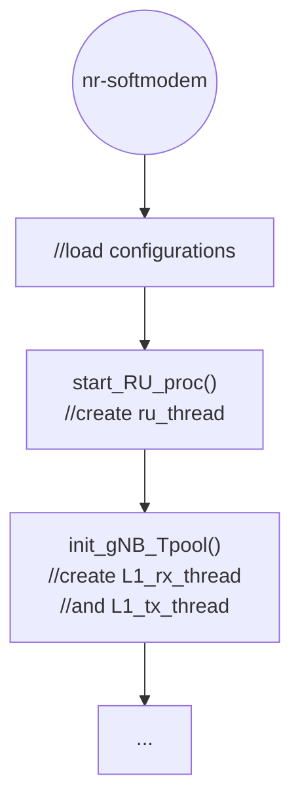
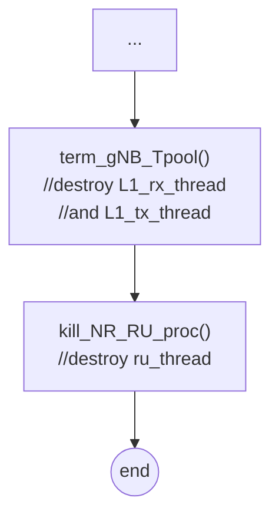
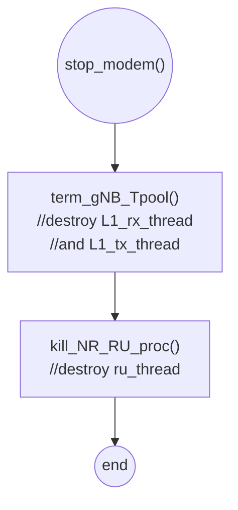
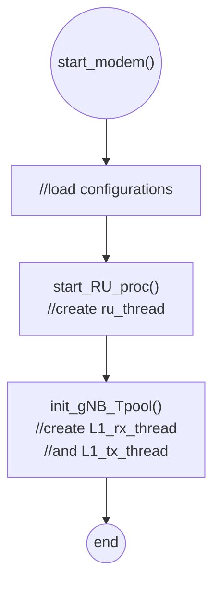
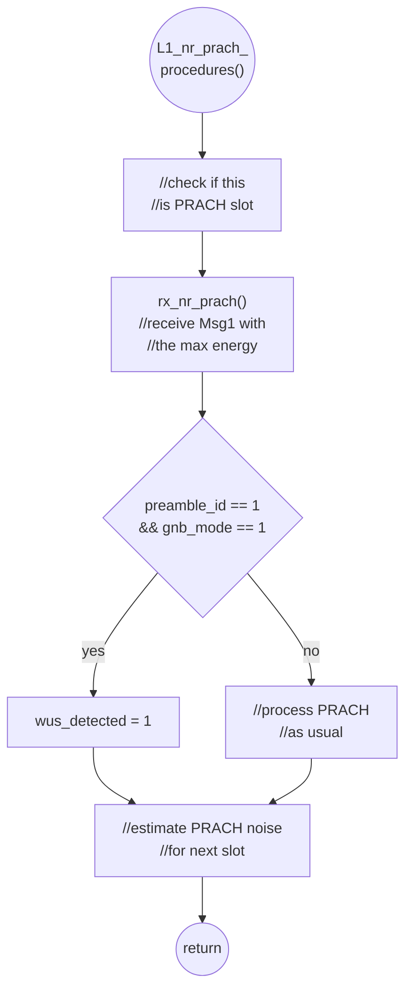
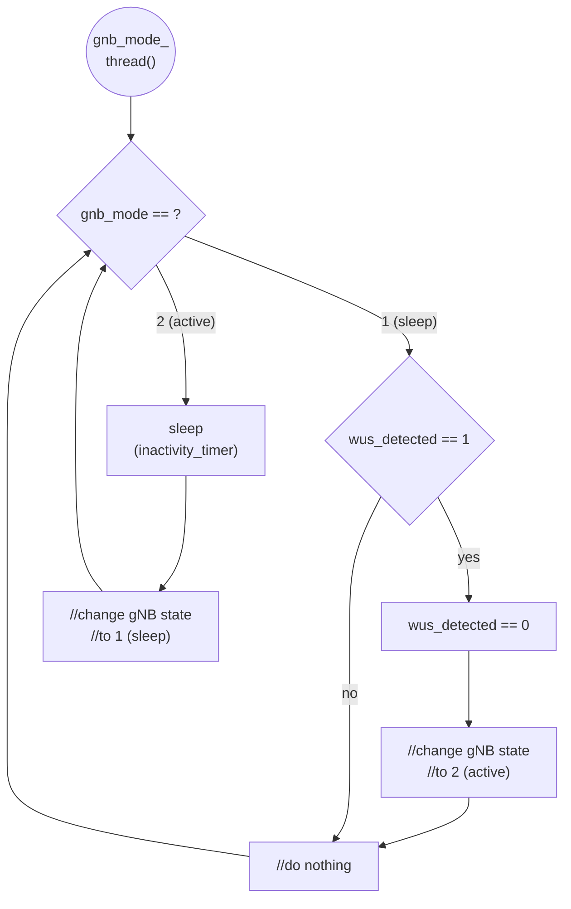

# Thesis (Test of PRACH Attacker for Basic Energy Saving Model)

###### tags: `2025`

**Goal:**
- [x] [Test PRACH Attacker for Basic Msg1 Model]()

**References:**
- [OAI 5G NR SA tutorial with OAI nrUE](https://gitlab.eurecom.fr/oai/openairinterface5g/-/blob/develop/doc/NR_SA_Tutorial_OAI_nrUE.md?ref_type=heads)
- [OAI UE + USRP B210 Installation Guide](https://hackmd.io/@zhongxin/BJSPWUy90)
- [Attacker guide for Wilfrid paper](https://ntust-bmwlab.notion.site/Attacker-guide-for-Wilfrid-paper-12d1009831438064b6afcf322b4fa252)
- [MTK UE Guide](https://github.com/bmw-ece-ntust/o-ran-docs/blob/2022-MS-Summer-OAI/UE/MTK%20UE/MTK%20UE%20Guide.md)

**Table of Contents:**
<small><i><a href='http://ecotrust-canada.github.io/markdown-toc/'>Table of contents generated with markdown-toc</a></i></small>

## 0. Summary

1. Moabc

## 1. PRACH Attacker for Basic Energy Saving Model

